# ARCHITECTURE.md — Gladys Dashboard (Unified Platform)

> Единая платформа-хаб для управления локальными Docker-проектами с централизованной аутентификацией, дашбордом продуктивности и интеграцией подпроектов.

---

## 1. Обзор системы

Gladys Dashboard — это оркестрирующий проект, который объединяет несколько независимых приложений под единым reverse proxy (Caddy), обеспечивает централизованную аутентификацию и предоставляет персональный дашборд продуктивности.

**Роль:** API Gateway + Dashboard UI + Infrastructure as Code
**Стек:** Caddy 2 (Gateway) · Vanilla JS (Dashboard) · Docker Compose · Make

---

## 2. Диаграмма системы (C4 — System Context)

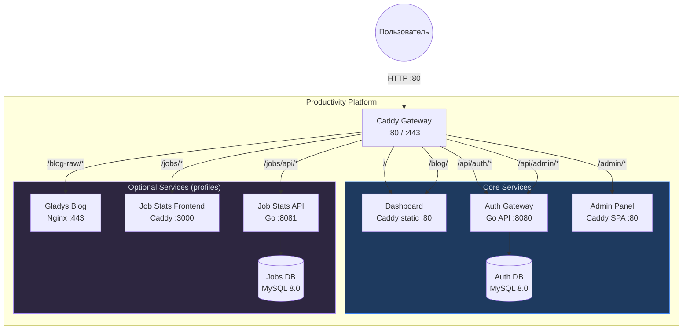

---

## 3. Структура проекта

```
Productivity/
├── docker-compose.yaml       # Единая оркестрация всех сервисов
├── Caddyfile                 # Gateway: роутинг + headers + encoding
├── DashboardCaddyfile        # Внутренний static server Dashboard
├── Makefile                  # Команды управления: up, down, up-all, logs, status
├── .env                      # Секреты: JWT_SECRET, DB credentials
├── .env.example              # Шаблон переменных окружения
├── www/                      # Статические файлы Dashboard
│   ├── index.html            # SPA: auth overlay + main content
│   ├── blog-wrapper.html     # iframe-обёртка для блога (Hugo не поддерживает nav)
│   ├── 403.html              # Страница 403 — нет прав доступа к проекту
│   ├── css/
│   │   ├── core.css          # Переменные, анимации, grid, header, footer, responsive
│   │   ├── panels.css        # Модальные окна, настройки виджетов, admin
│   │   └── widgets/          # Стили каждого виджета (по файлу)
│   │       ├── quote.css … ai-assistant.css
│   │       └── server-build.css
│   ├── js/
│   │   ├── core/
│   │   │   ├── utils.js          # uid(), escHtml(), todayStr(), fmtDate(), showToast()
│   │   │   ├── widget-manager.js # WidgetRegistry, registerWidget(), visibility, reorder
│   │   │   ├── projects.js       # Навигация по проектам
│   │   │   ├── clock-notif.js    # Часы + уведомления
│   │   │   ├── zen-mode.js       # Zen mode, day-off, scroll arrows
│   │   │   ├── keyboard.js       # Горячие клавиши
│   │   │   ├── briefing.js       # Утренний брифинг + ретроспектива
│   │   │   └── export-import.js  # exportData(), importData()
│   │   ├── widgets/              # Каждый виджет — отдельный файл с registerWidget()
│   │   │   ├── quote.js          personal-bar.js    running.js
│   │   │   ├── schedule.js       todo.js            stickers.js
│   │   │   ├── weekend-plan.js   principles.js      key-skills.js
│   │   │   ├── goals.js          stats.js           reading.js
│   │   │   ├── productivity.js   go-roadmap.js      scratchpad.js
│   │   │   ├── server-build.js   ai-assistant.js
│   │   │   └── (каждый вызывает registerWidget() в конце)
│   │   ├── data/
│   │   │   ├── go-data.js        # Данные Go-уроков
│   │   │   └── training-data.js  # Загрузчик CSV: план тренировок + рекорды
│   │   ├── app.js            # Тонкий оркестратор (roundRect polyfill)
│   │   ├── auth.js           # Аутентификация: login, register, verify
│   │   └── word-of-day.js    # Слово дня: API + кэш + архив
│   ├── data/
│   │   ├── words.json              # Словарь для "Слова дня"
│   │   ├── dashboard-data-default.json  # Дефолтные данные для новых пользователей
│   │   ├── training_schedule.csv   # → symlink / docker mount из 5run
│   │   └── records_sorted.csv     # → symlink / docker mount из 5run
│   └── quotes.json           # Цитаты (генерируются из markdown)
├── tests/                    # Jest UI тесты Dashboard
│   ├── Dockerfile            # Docker-контейнер для тестов
│   ├── package.json          # Jest + jsdom зависимости
│   ├── jest.config.js        # Конфигурация Jest
│   └── src/                  # Тесты
│       ├── setup.js          # Глобальные моки (fetch, AudioContext, confirm)
│       ├── helpers.js        # Загрузчик JS-файлов Dashboard в jsdom
│       ├── core/             # Тесты core модулей
│       └── widgets/          # Тесты виджетов (CRUD, render, registration)
├── scripts/
│   └── parse_quotes.py       # Парсер цитат
├── docs/
│   ├── auth-architecture.md  # Документация auth-архитектуры
│   ├── widget-guide.md       # Руководство по созданию нового виджета
│   ├── project-registration-guide.md  # Руководство по регистрации проектов
│   └── new-project-guide.md  # Руководство по созданию нового проекта
└── CLAUDE.md                 # Инструкции для AI-ассистента
```

---

## 4. Сетевая архитектура

### 4.1 Docker Networks

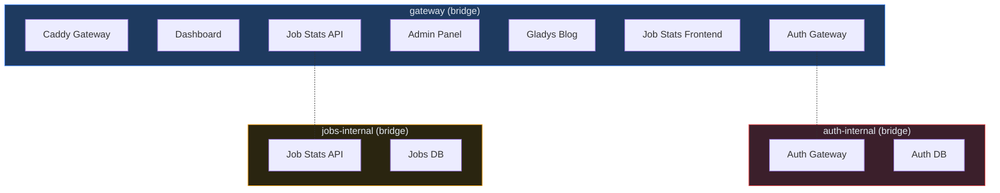

### 4.2 Изоляция сетей

| Сеть | Участники | Назначение |
|------|-----------|-----------|
| `gateway` | Все сервисы + Caddy | Маршрутизация HTTP-трафика |
| `auth-internal` | Auth Gateway + Auth DB | Изоляция БД аутентификации |
| `jobs-internal` | Job Stats API + Jobs DB | Изоляция БД вакансий |

**Принцип:** Базы данных доступны только из своей internal-сети. Gateway-сеть обеспечивает связность между фронтендами и API через Caddy.

---

## 5. Caddy Gateway — маршрутизация

### 5.1 Таблица маршрутов

```
:80 {
    /api/auth/*          → auth-gateway:8080     (public, без forward_auth)
    /api/health          → auth-gateway:8080     (probe)
    /api/admin/*         → auth-gateway:8080     (protected middleware)

    /admin/*             → auth-admin:80         (strip /admin, perm: admin)
    /admin               → /admin/ (redirect)

    /blog/               → /srv/www/blog-wrapper.html (iframe, perm: blog)
    /blog                → /blog/ (redirect)
    /blog-raw/*          → gladys-blog:80        (strip /blog-raw)
    /blog-raw            → /blog-raw/ (redirect)

    /blog-admin/api/*    → blog-admin:8083       (strip /blog-admin, role: admin)
    /blog-admin/*        → blog-admin:8083       (strip /blog-admin, role: admin)
    /blog-admin          → /blog-admin/ (redirect)

    /jobs/api/*          → job-stats-api:8081    (strip /jobs)
    /jobs/*              → job-stats-frontend:3000 (strip /jobs, perm: jobs)
    /jobs                → /jobs/ (redirect)

    /chat/api/*          → gladys-chat-api:8082  (strip /chat)
    /chat/ws             → gladys-chat-api:8082  (strip /chat, WebSocket)
    /chat/*              → gladys-chat-frontend:80 (strip /chat, perm: chat)
    /chat                → /chat/ (redirect)

    /*                   → dashboard:80          (default, catch-all)
}

Контроль доступа на уровне Caddy (forward_auth + header_regexp X-Auth-Permissions):
- 401 (нет JWT) → redirect на /?redirect={path} → Dashboard показывает форму входа/регистрации
- Нет permission → Caddy отдаёт /srv/www/403.html (статическая страница)
```

### 5.2 Диаграмма маршрутизации

```mermaid
flowchart LR
    REQ["HTTP :80"] --> CADDY["Caddy Gateway"]

    CADDY -->|"/api/auth/*"| AUTH["Auth Gateway<br/>:8080"]
    CADDY -->|"/api/admin/*"| AUTH
    CADDY -->|"/admin/*"| ADMIN_UI["Admin Panel<br/>:80"]
    CADDY -->|"/blog/"| WRAPPER["blog-wrapper.html<br/>(static)"]
    CADDY -->|"/blog-raw/*"| BLOG["Gladys Blog<br/>:443"]
    CADDY -->|"/jobs/api/*"| JOBS_API["Job Stats API<br/>:8081"]
    CADDY -->|"/jobs/*"| JOBS_FE["Job Stats FE<br/>:3000"]
    CADDY -->|"/chat/api/*"| CHAT_API["Chat API<br/>:8082"]
    CADDY -->|"/chat/ws"| CHAT_API
    CADDY -->|"/chat/*"| CHAT_FE["Chat FE<br/>:80"]
    CADDY -->|"/*"| DASH["Dashboard<br/>:80"]

    WRAPPER -->|"iframe src"| BLOG

    CADDY -.->|"401"| REDIR["/?redirect={path}<br/>→ Dashboard login"]
    CADDY -.->|"no perm"| DENY["/403.html"]
```

### 5.3 HTTP Headers

| Path | Header | Значение |
|------|--------|---------|
| `*` | `X-Content-Type-Options` | `nosniff` |
| `/blog-raw/*` | `X-Frame-Options` | `SAMEORIGIN` |
| `*` | `Content-Encoding` | gzip / zstd |

---

## 6. Архитектура Dashboard UI

### 6.1 Модульная структура JavaScript

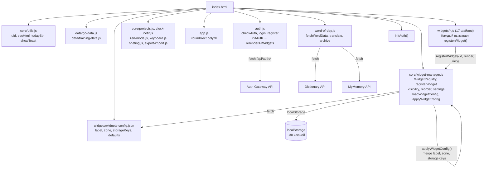

### 6.2 Порядок инициализации

Порядок `<script>` тегов:
1. `core/utils.js` → `core/widget-manager.js` (всегда первые)
2. `data/*.js` (данные)
3. `widgets/*.js` (каждый вызывает `registerWidget()` при загрузке)
4. `core/projects.js`, `core/clock-notif.js`, `core/zen-mode.js`, `core/keyboard.js`, `core/briefing.js`, `core/export-import.js`
5. `app.js` → `auth.js` → `word-of-day.js` → `initAuth()`

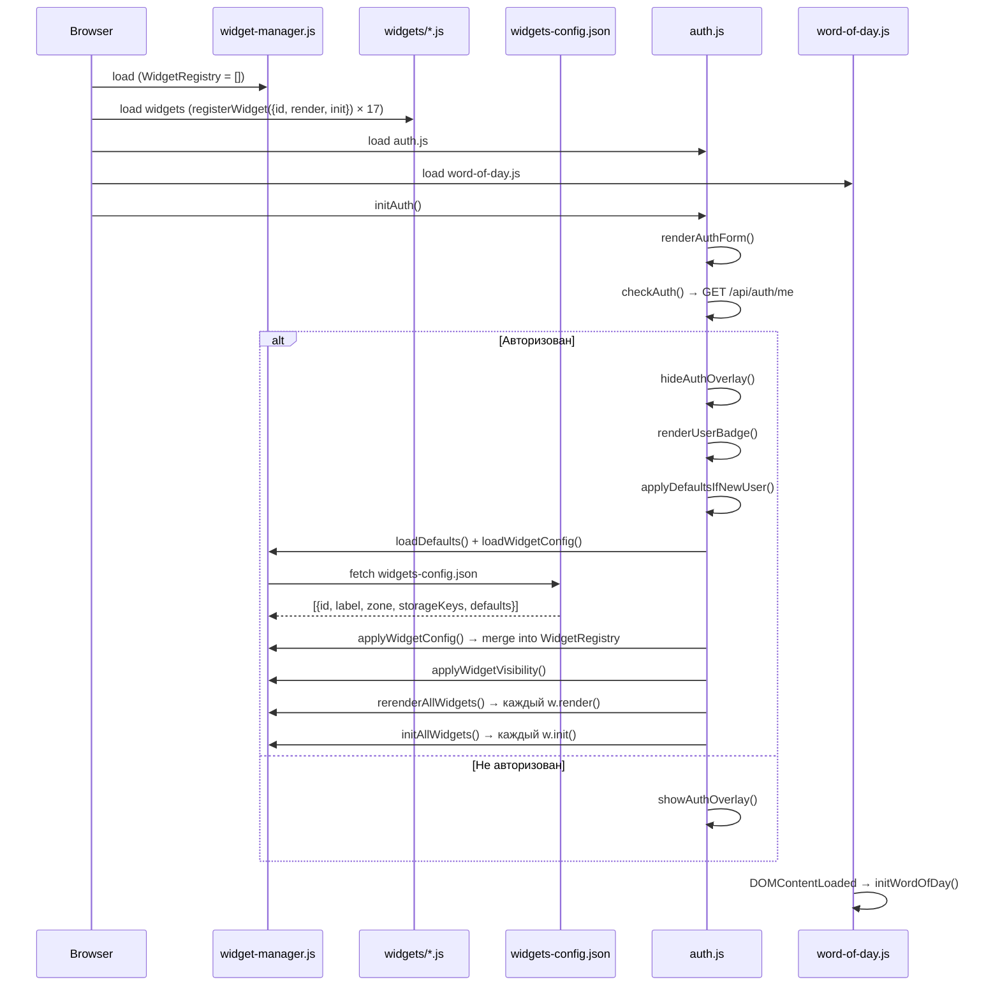

### 6.3 Компоненты Dashboard

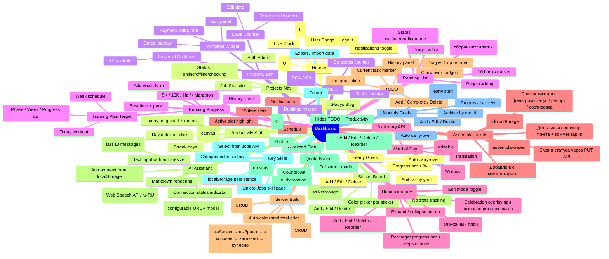

### 6.4 Адаптивный дизайн (Responsive)

**Принцип:** страница никогда не имеет горизонтального скролла (`body`, `#main-content` — `overflow-x: hidden`). Каждый отдельный виджет при необходимости показывает собственный горизонтальный скролл (`.card, .widget, .stat` — `overflow-x: auto; min-width: 0`).

**Breakpoints:**
| Breakpoint | Назначение |
|-----------|------------|
| `≤ 900px` | Сетка → 1 колонка, уменьшенные отступы, Go-табы со скроллом |
| `≤ 700px` | Навигация проектов: скрыты описания, горизонтальный скролл |
| `≤ 500px` | Карточки: меньше padding/border-radius, footer компактнее |
| `≤ 480px` | Мобильный: все виджеты адаптированы (компактные шрифты, flex-wrap, видимые действия на touch) |

**Overflow containment** (full-width секции):
- `.running-section` — `overflow: hidden`
- `.wod-section` — `overflow: hidden`
- `#quote-banner` — `overflow: hidden`
- `.personal-bar, footer` — `overflow: hidden; min-width: 0`
- `.full-width` — `min-width: 0`

**CSS-файлы:**
- `css/core.css` — глобальные overflow-правила, grid responsive, header/footer mobile
- `css/panels.css` — навигация проектов (горизонтальный скролл), модалки, auth-card responsive
- `css/widgets/*.css` — каждый виджет имеет свои `@media (max-width: 480px)` правила

### 6.5 Хранилище данных (localStorage)

| Ключ | Тип | Описание |
|------|-----|----------|
| `prod_days_v1` | `{startDate, failCount}` | Счётчик дней без привычки |
| `prod_cushions` | `number` | Финансовые подушки |
| `prod_mortgage_v1` | `{payment, debt, rate, ...}` | Ипотека |
| `prod_notif_enabled` | `"0"\|"1"` | Уведомления вкл/выкл |
| `prod_zen_mode` | `"0"\|"1"` | Фокус-режим вкл/выкл |
| `prod_day_off` | `"0"\|"1"` | Режим выходного дня вкл/выкл |
| `prod_tasks_v1` | `[{id, text, done, current, ...}]` | Задачи |
| `prod_history_v1` | `[{id, text, addedAt, doneAt, workedMs}]` | История задач |
| `prod_stickers_v1` | `[{id, text, done, color, createdAt}]` | Доска напоминаний (стикеры) |
| `prod_weekend_tasks_v1` | `[{id, text, done}]` | План выходного дня (только Сб/Вс) |
| `prod_monthly_goals_v2` | `{monthKey: [{id, text, icon, done, recurring?, carriedFrom?}]}` | Цели на месяц (по ключу YYYY-MM) |
| `prod_yearly_goals_v2` | `{yearKey: [{id, text, icon, done, recurring?, carriedFrom?}]}` | Цели на год (по ключу YYYY) |
| `prod_daily_snapshot_v1` | `{dateStr: {completed, remaining, totalMs, ...}}` | Снимки продуктивности по дням |
| `prod_early_start_v1` | `{monthKey: {dateStr: {time, success}}}` | Трекер раннего старта 7:00–8:00 |
| `prod_stat_go` | `number` | Счётчик Go-скриптов |
| `prod_stat_tasks` | `number` | Счётчик рабочих задач |
| `prod_stat_duo` | `number` | Пропуски Duolingo |
| `prod_schedule_labels_v1` | `{index: {label, sub}}` | Пользовательские названия окон расписания |
| `prod_reading_books_v1` | `[{id, title, author, type, subItems?}]` | Список книг для чтения (пользовательский) |
| `prod_reading_v1` | `{bookId: {status, page, startedAt}}` | Прогресс чтения (включая sub-items сборников/трилогий) |
| `prod_assembla_config_v1` | `{apiKey, apiSecret, spaceId}` | Конфиг Assembla виджета (ключи API, ID пространства) |
| `prod_targets_v1` | `[{id, title, createdAt}]` | Цели с пошаговым планом (CRUD) |
| `prod_target_steps_v1` | `{targetId: [{id, title, done, createdAt}]}` | Шаги для каждой цели (вложенный CRUD) |
| `prod_running_v1` | `{distId: [{secs, date, addedAt}]}` | Результаты бега |
| `prod_wod_cache` | `{word, wordRu, ...}` | Кэш слова дня |
| `prod_wod_archive_v1` | `[{word, date, ...}]` | Архив слов (90 дней) |
| `prod_scratchpad_v1` | `{text, date, history: {date: text}}` | Быстрые заметки с историей по дням |
| `prod_distractions_v1` | `{dateStr: [{category, time}]}` | Лог отвлечений по дням |
| `prod_briefing_dismissed` | `"YYYY-MM-DD"` | Дата закрытия утреннего брифинга |
| `prod_retrospective_v1` | `{weekKey: {stats, note, createdAt}}` | Еженедельные ретроспективы |
| `prod_go_lessons_v1` | `{lessonId: {done, doneAt}}` | Прогресс уроков Syncthing |
| `prod_go_tour_v1` | `{exerciseId: {done, doneAt}}` | Прогресс Go Tour упражнений |
| `prod_go_code_v1` | `{itemId: {done, doneAt}}` | Прогресс изучения кода |
| `prod_go_start_date` | `"YYYY-MM-DD"` | Дата начала Go уроков |
| `prod_key_skills_v1` | `[{id, name, category}]` | Ключевые навыки (связь с Jobs) |
| `prod_ai_history_v1` | `[{role, content, timestamp}]` | История чата AI ассистента |
| `prod_server_build_v1` | `[{id, component, model, price, link, status}]` | Компоненты серверной сборки (CRUD) |
| `prod_server_models_v1` | `[{id, name, size, vram, speed, quality}]` | Совместимые модели Ollama (CRUD) |
| `prod_ai_ollama_url` | `string` | URL Ollama сервера (default: `http://localhost:11434`) |
| `prod_ai_model` | `string` | Модель Ollama (default: `gemma3:4b`) |

---

## 7. Аутентификация

### 7.1 Поток авторизации Dashboard

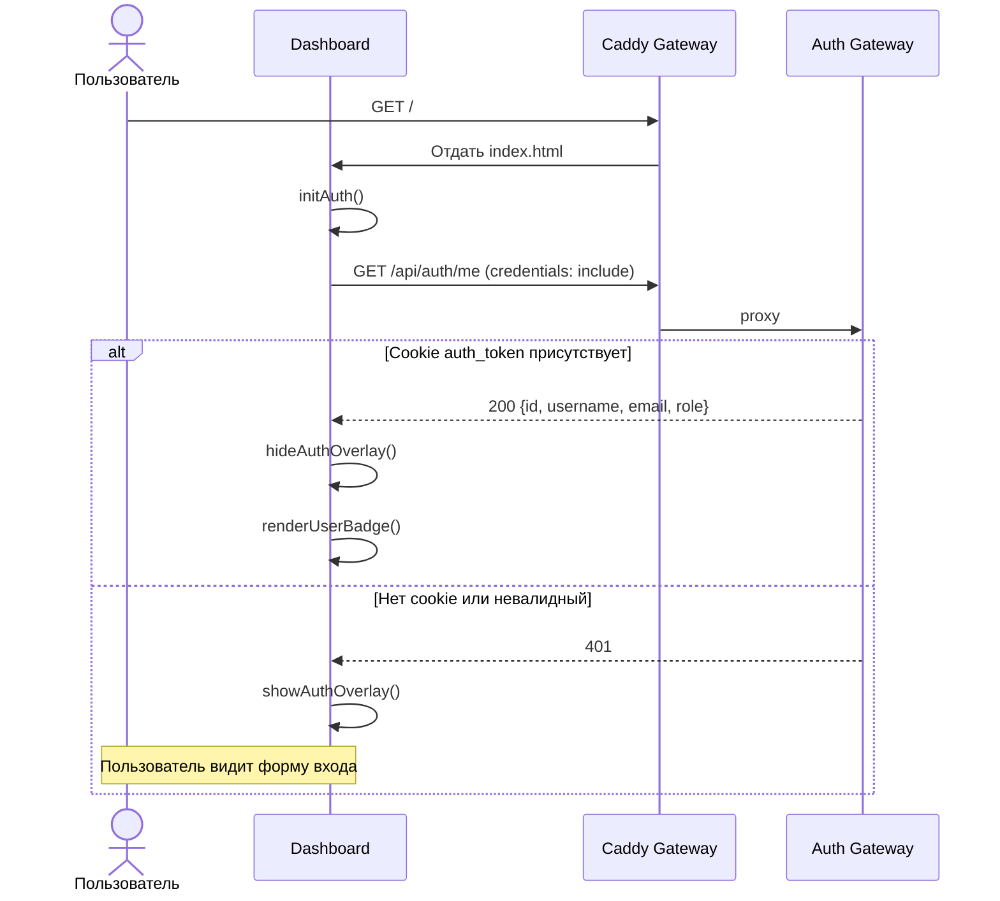

### 7.2 RBAC в контексте платформы

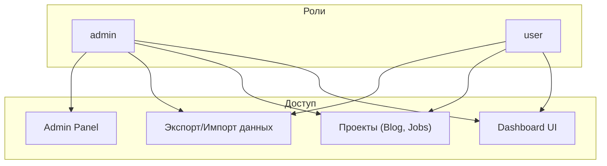

---

## 8. Docker Compose — оркестрация

### 8.1 Сервисы


### 8.2 Профили Docker Compose

| Профиль | Сервисы | Команда |
|---------|---------|---------|
| (default) | gateway, dashboard, auth-gateway, auth-admin, auth-db | `make up` |
| `blog` | + gladys-blog, blog-admin | `make up-blog` |
| `jobs` | + job-stats-frontend, job-stats-api, job-stats-db | `make up-jobs` |
| `blog` + `jobs` | Все сервисы | `make up-all` |

### 8.3 Volumes

| Volume | Тип | Контейнер | Mount |
|--------|-----|-----------|-------|
| `caddy_data` | Named | gateway | /data |
| `caddy_config` | Named | gateway | /config |
| `auth_data` | Named | auth-db | /var/lib/mysql |
| `jobs_data` | External | job-stats-db | /var/lib/mysql |
| `blog_content` | Named | blog-admin | /blog |
| `blog_public` | Named | blog-admin (rw), gladys-blog (ro) | /blog/public, /usr/share/nginx/html |
| `./www` | Bind (ro) | gateway, dashboard | /srv/www |
| `./Caddyfile` | Bind (ro) | gateway | /etc/caddy/Caddyfile |

---

## 9. Интеграция подпроектов

### 9.1 Как подпроект интегрируется в платформу

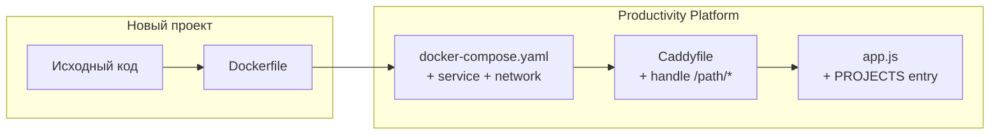

### 9.2 Чеклист добавления проекта

1. **Docker Compose:** добавить сервис, подключить к `gateway` network, указать profile
2. **Caddyfile:** добавить `handle /path/*` с `route { forward_auth + handle_response @unauthed + header_regexp permission check + 403 fallback }`
3. **Dashboard `app.js`:** добавить объект в `PROJECTS` и permission в `PROJECT_PERMISSIONS`
4. **API URL:** в подпроекте реализовать определение `basename` / API URL по `window.location.pathname`

### 9.3 Паттерн обнаружения Gateway-режима

Каждый подпроект проверяет, запущен ли он через Gateway:

```javascript
// Job Statistics (React)
const basename = window.location.pathname.startsWith('/jobs') ? '/jobs' : '/';
const API_BASE = basename === '/jobs' ? '/jobs/api/v1' : 'http://localhost:8081/api/v1';

// Admin Panel (Vanilla JS)
function isGatewayMode() {
  return window.location.pathname.startsWith('/admin');
}
```

---

## 10. Контроль доступа к проектам (Caddy-level)

Caddy проверяет доступ на уровне Gateway через `forward_auth` + `header_regexp X-Auth-Permissions`:

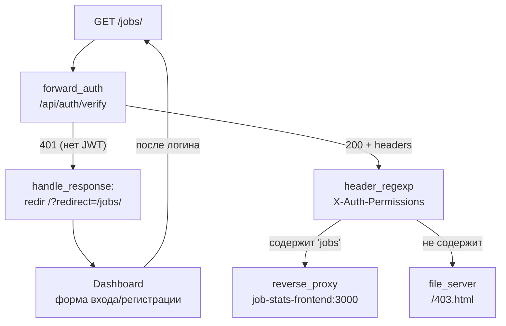

| Маршрут | Permission | Действие при наличии | Действие при отсутствии |
|---------|-----------|---------------------|----------------------|
| `/admin/*` | `admin` | reverse_proxy auth-admin:80 | 403.html |
| `/blog/` | `blog` | serve blog-wrapper.html | 403.html |
| `/jobs/*` | `jobs` | reverse_proxy job-stats-frontend:3000 | 403.html |
| `/chat/*` | `chat` | reverse_proxy gladys-chat-frontend:80 | 403.html |

**Блог — исключение:** использует iframe-обёртку (`blog-wrapper.html`), т.к. Hugo не поддерживает навигацию "← Dashboard". Остальные проекты (React/Go SPA) проксируются напрямую.

**Регистрация:** единая через Auth Gateway. После `/?redirect={path}` Dashboard показывает форму входа/регистрации, после успешной авторизации — redirect обратно на проект. Все пользователи доступны в админке.

### Связь downstream-проектов с Auth DB

| Проект | Связь с Auth DB | Описание |
|--------|----------------|----------|
| **Gladys Chat** | `users.auth_user_id` → Auth `users.id` | Каждый чат уникален для пользователя |
| **Job Statistics** | `users.auth_user_id` → Auth `users.id` | Вакансии привязаны к пользователю через `jobs.user_id` |
| **Gladys Blog** | Не требуется | Статический контент, доступ через `forward_auth` |

### RBAC в Job Statistics

| Сущность | GET | POST/PUT/DELETE |
|----------|-----|----------------|
| **Companies, Skills, Locations** | Все пользователи | Только админ (справочные данные) |
| **Jobs** | Админ — все, user — только свои | Админ — любые, user — только свои |
| **Stats** | Все пользователи | — (read-only) |

При удалении пользователя (Auth Gateway soft delete) вакансии остаются с `user_id = NULL` (ON DELETE SET NULL) — видны только админу.

---

## 11. Внешние API

| API | Использование | Файл |
|-----|--------------|------|
| `api.dictionaryapi.dev` | Определения слов (en) | word-of-day.js |
| `api.mymemory.translated.net` | Перевод en→ru | word-of-day.js |
| Ollama `/api/chat` | AI ассистент (LLM inference) | app.js |

---

## 12. Проверка доступности проектов

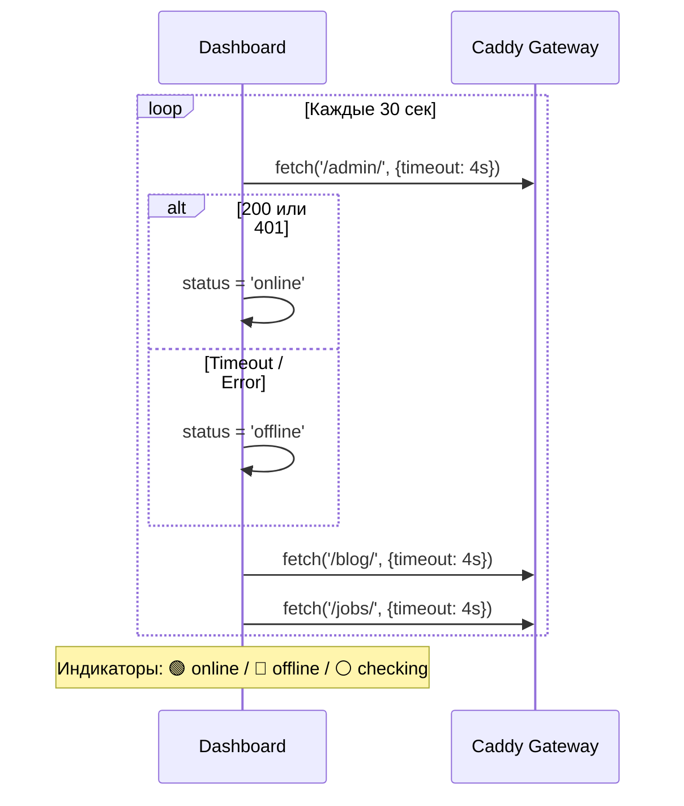

---

## 13. Makefile — команды управления

```makefile
up              # Core: Dashboard + Auth Gateway
down            # Stop all services (all profiles)
restart         # Restart core
logs            # Follow logs (all profiles)
up-all          # ALL: core + blog + jobs + chat + sketchbook
up-blog         # Core + Gladys Blog
up-jobs         # Core + Job Statistics
up-chat         # Core + Gladys Chat
up-sketchbook   # Core + Sketchbook
quotes          # Parse quotes from markdown → quotes.json
open            # Open Dashboard in browser
build-auth      # Rebuild Auth Gateway containers
clean           # Remove all volumes and containers
status          # Show status of all services

# Job Statistics: сборка и тесты
jobs-rebuild           # Пересобрать API + Frontend (без кэша)
jobs-rebuild-api       # Пересобрать только API
jobs-rebuild-frontend  # Пересобрать только Frontend
jobs-logs              # Логи Job Statistics
jobs-test-backend      # Unit-тесты Go backend (локально)
jobs-test              # Jest тесты фронтенда (Docker)
jobs-test-coverage     # Jest тесты + покрытие
jobs-lint              # ESLint проверка
jobs-lint-fix          # ESLint с авто-исправлением
jobs-migrate           # Применить миграции БД
jobs-seed              # Загрузить тестовые данные (DESTRUCTIVE)

# Gladys Chat: сборка
chat-rebuild           # Пересобрать API + Frontend (без кэша)
chat-rebuild-api       # Пересобрать только API
chat-rebuild-frontend  # Пересобрать только Frontend
chat-logs              # Логи Gladys Chat
chat-migrate           # Применить миграции БД
```

---

## 14. Диаграмма зависимостей между проектами

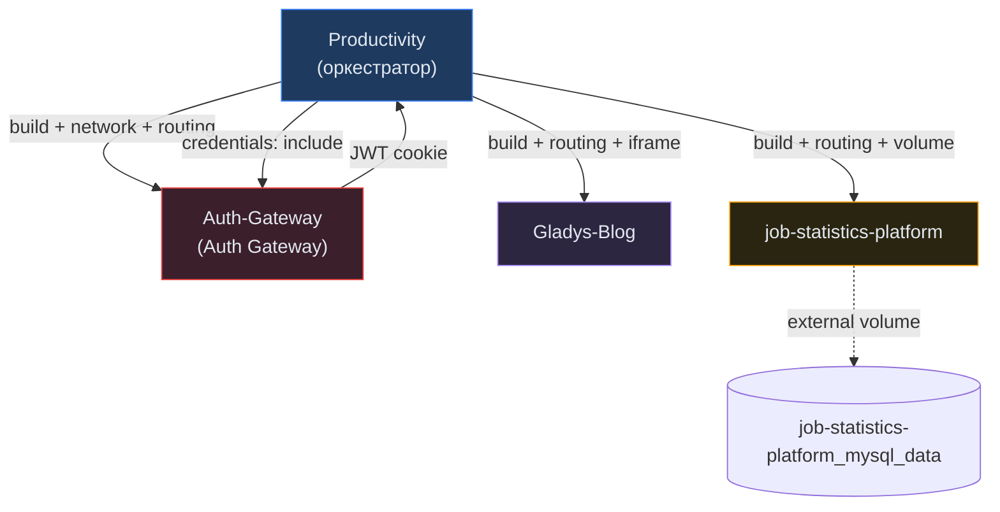

**Ключевые связи:**
- **Productivity → Auth-Gateway:** JWT-аутентификация через HttpOnly cookie
- **Productivity → Gladys-Blog:** iframe + TLS-проксирование (skip verify)
- **Productivity → job-statistics-platform:** URI strip prefix, external volume для сохранения данных
- **Все подпроекты → Productivity:** Обнаружение gateway-режима по `window.location.pathname`
