# ARCHITECTURE.md — Gladys Dashboard (Unified Platform)

> A unified hub platform for managing local Docker projects with centralized authentication, a productivity dashboard, and sub-project integration.

---

## 1. System Overview

Gladys Dashboard is an orchestrating project that unites several independent applications under a single reverse proxy (Caddy), provides centralized authentication, and offers a personal productivity dashboard.

**Role:** API Gateway + Dashboard UI + Infrastructure as Code
**Stack:** Caddy 2 (Gateway) · Vanilla JS (Dashboard) · Docker Compose · Make

---

## 2. System Diagram (C4 — System Context)

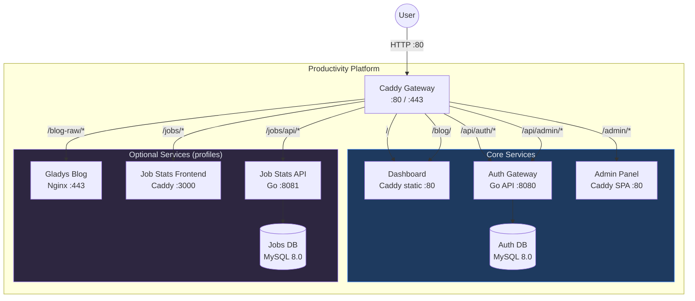

---

## 3. Project Structure

```
Productivity/
├── docker-compose.yaml       # Unified orchestration of all services
├── Caddyfile                 # Gateway: routing + headers + encoding
├── DashboardCaddyfile        # Internal static server for Dashboard
├── Makefile                  # Management commands: up, down, up-all, logs, status
├── .env                      # Secrets: JWT_SECRET, DB credentials
├── .env.example              # Environment variables template
├── www/                      # Dashboard static files
│   ├── index.html            # SPA: auth overlay + main content
│   ├── blog-wrapper.html     # iframe wrapper for blog (Hugo doesn't support nav)
│   ├── 403.html              # 403 page — no access rights to project
│   ├── css/
│   │   ├── core.css          # Variables, animations, grid, header, footer, responsive
│   │   ├── panels.css        # Modals, widget settings, admin
│   │   └── widgets/          # Styles for each widget (per file)
│   │       ├── quote.css … ai-assistant.css
│   │       └── server-build.css
│   ├── js/
│   │   ├── core/
│   │   │   ├── utils.js          # uid(), escHtml(), todayStr(), fmtDate(), showToast()
│   │   │   ├── widget-manager.js # WidgetRegistry, registerWidget(), visibility, reorder
│   │   │   ├── projects.js       # Project navigation
│   │   │   ├── clock-notif.js    # Clock + notifications
│   │   │   ├── zen-mode.js       # Zen mode, day-off, scroll arrows
│   │   │   ├── keyboard.js       # Hotkeys
│   │   │   ├── briefing.js       # Morning briefing + retrospective
│   │   │   └── export-import.js  # exportData(), importData()
│   │   ├── widgets/              # Each widget is a separate file with registerWidget()
│   │   │   ├── quote.js          personal-bar.js    running.js
│   │   │   ├── schedule.js       todo.js            stickers.js
│   │   │   ├── weekend-plan.js   principles.js      key-skills.js
│   │   │   ├── goals.js          stats.js           reading.js
│   │   │   ├── productivity.js   go-roadmap.js      scratchpad.js
│   │   │   ├── server-build.js   ai-assistant.js
│   │   │   └── (each calls registerWidget() at the end)
│   │   ├── data/
│   │   │   ├── go-data.js        # Go lessons data
│   │   │   └── training-data.js  # CSV loader: training plan + records
│   │   ├── app.js            # Thin orchestrator (roundRect polyfill)
│   │   ├── auth.js           # Authentication: login, register, verify
│   │   └── word-of-day.js    # Word of the day: API + cache + archive
│   ├── data/
│   │   ├── words.json              # Dictionary for "Word of the Day"
│   │   ├── dashboard-data-default.json  # Default data for new users
│   │   ├── training_schedule.csv   # → symlink / docker mount from 5run
│   │   └── records_sorted.csv     # → symlink / docker mount from 5run
│   └── quotes.json           # Quotes (generated from markdown)
├── tests/                    # Dashboard UI Jest tests
│   ├── Dockerfile            # Docker container for tests
│   ├── package.json          # Jest + jsdom dependencies
│   ├── jest.config.js        # Jest configuration
│   └── src/                  # Tests
│       ├── setup.js          # Global mocks (fetch, AudioContext, confirm)
│       ├── helpers.js        # Dashboard JS loader for jsdom
│       ├── core/             # Core module tests
│       └── widgets/          # Widget tests (CRUD, render, registration)
├── scripts/
│   └── parse_quotes.py       # Quotes parser
├── docs/
│   ├── auth-architecture.md  # Auth architecture documentation
│   ├── widget-guide.md       # Guide for creating a new widget
│   ├── project-registration-guide.md  # Guide for registering projects
│   └── new-project-guide.md  # Guide for creating a new project
└── CLAUDE.md                 # Instructions for AI assistant
```

---

## 4. Network Architecture

### 4.1 Docker Networks

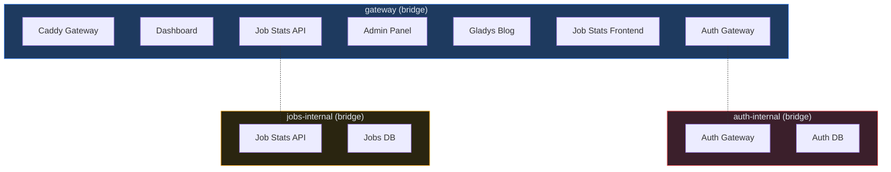

### 4.2 Network Isolation

| Network | Participants | Purpose |
|------|-----------|-----------|
| `gateway` | All services + Caddy | HTTP traffic routing |
| `auth-internal` | Auth Gateway + Auth DB | Isolation of authentication DB |
| `jobs-internal` | Job Stats API + Jobs DB | Isolation of jobs DB |

**Principle:** Databases are accessible only from their respective internal networks. The gateway network provides connectivity between frontends and APIs via Caddy.

---

## 5. Caddy Gateway — Routing

### 5.1 Routing Table

```
:80 {
    /api/auth/*          → auth-gateway:8080     (public, no forward_auth)
    /api/health          → auth-gateway:8080     (probe)
    /api/admin/*         → auth-gateway:8080     (protected middleware)

    /admin/*             → auth-admin:80         (strip /admin, perm: admin)
    /admin               → /admin/ (redirect)

    /blog/               → /srv/www/blog-wrapper.html (iframe, perm: blog)
    /blog                → /blog/ (redirect)
    /blog-raw/*          → gladys-blog:80        (strip /blog-raw)
    /blog-raw            → /blog-raw/ (redirect)

    /blog-admin/api/*    → blog-admin:8083       (strip /blog-admin, role: admin)
    /blog-admin/*        → blog-admin:8083       (strip /blog-admin, role: admin)
    /blog-admin          → /blog-admin/ (redirect)

    /jobs/api/*          → job-stats-api:8081    (strip /jobs)
    /jobs/*              → job-stats-frontend:3000 (strip /jobs, perm: jobs)
    /jobs                → /jobs/ (redirect)

    /chat/api/*          → gladys-chat-api:8082  (strip /chat)
    /chat/ws             → gladys-chat-api:8082  (strip /chat, WebSocket)
    /chat/*              → gladys-chat-frontend:80 (strip /chat, perm: chat)
    /chat                → /chat/ (redirect)

    /*                   → dashboard:80          (default, catch-all)
}

Access control at Caddy level (forward_auth + header_regexp X-Auth-Permissions):
- 401 (no JWT) → redirect to /?redirect={path} → Dashboard shows login/register form
- No permission → Caddy returns /srv/www/403.html (static page)
```

### 5.2 Routing Diagram

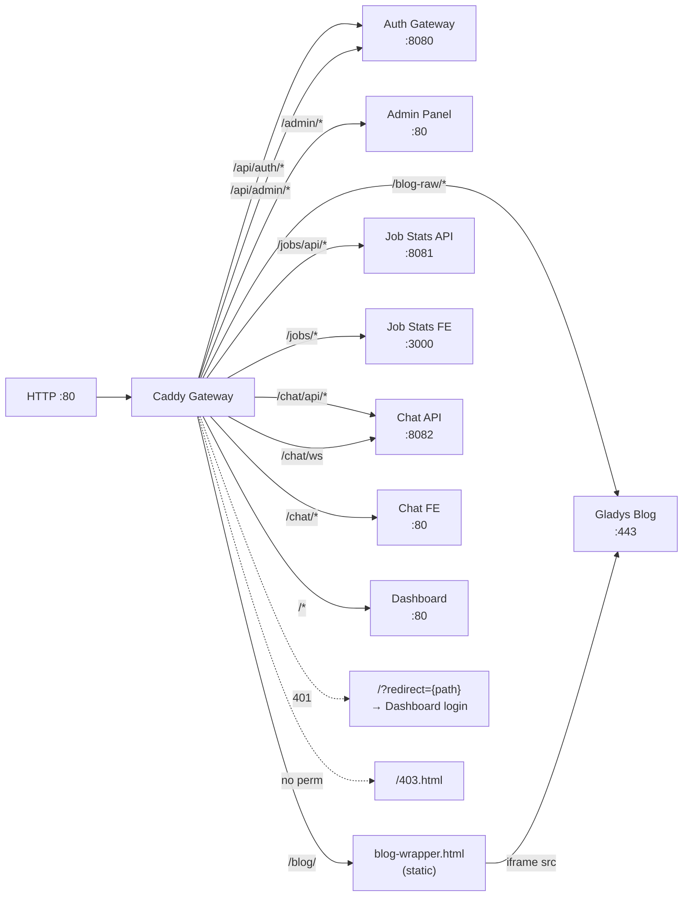

### 5.3 HTTP Headers

| Path | Header | Value |
|------|--------|---------|
| `*` | `X-Content-Type-Options` | `nosniff` |
| `/blog-raw/*` | `X-Frame-Options` | `SAMEORIGIN` |
| `*` | `Content-Encoding` | gzip / zstd |

---

## 6. Dashboard UI Architecture

### 6.1 Modular JavaScript Structure

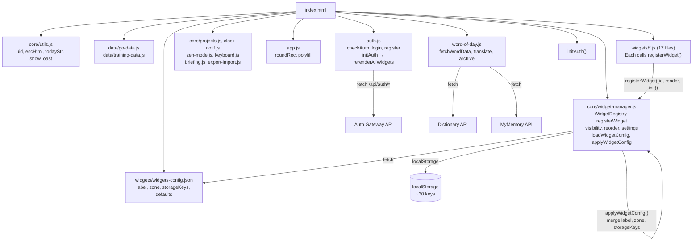

### 6.2 Initialization Order

`<script>` tag order:
1. `core/utils.js` → `core/widget-manager.js` (always first)
2. `data/*.js` (data)
3. `widgets/*.js` (each calls `registerWidget()` on load)
4. `core/projects.js`, `core/clock-notif.js`, `core/zen-mode.js`, `core/keyboard.js`, `core/briefing.js`, `core/export-import.js`
5. `app.js` → `auth.js` → `word-of-day.js` → `initAuth()`

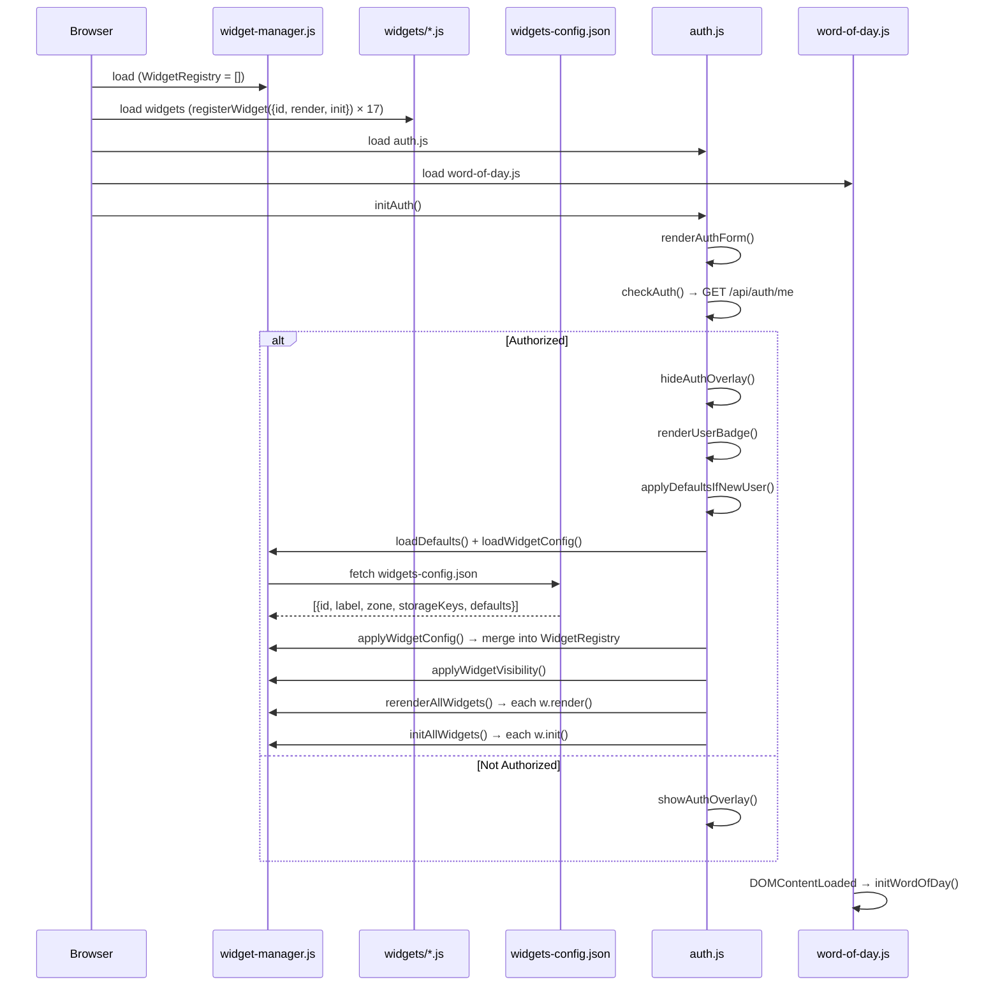

### 6.3 Dashboard Components

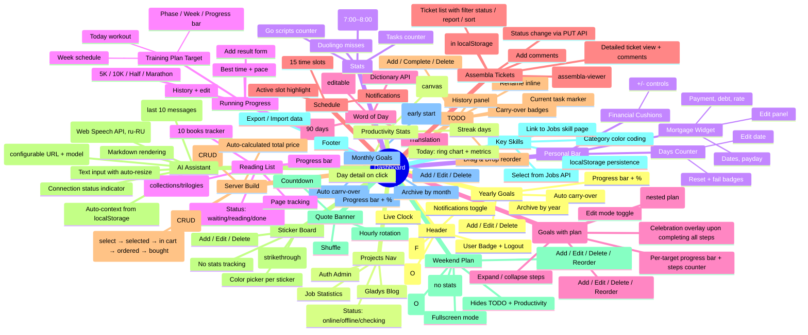

### 6.4 Responsive Design

**Principle:** The page never has horizontal scroll (`body`, `#main-content` — `overflow-x: hidden`). Each individual widget shows its own horizontal scroll if necessary (`.card, .widget, .stat` — `overflow-x: auto; min-width: 0`).

**Breakpoints:**
| Breakpoint | Purpose |
|-----------|------------|
| `≤ 900px` | Grid → 1 column, reduced margins, Go tabs with scroll |
| `≤ 700px` | Projects nav: descriptions hidden, horizontal scroll |
| `≤ 500px` | Cards: smaller padding/border-radius, compact footer |
| `≤ 480px` | Mobile: all widgets adapted (compact fonts, flex-wrap, touch-friendly actions) |

**Overflow containment** (full-width sections):
- `.running-section` — `overflow: hidden`
- `.wod-section` — `overflow: hidden`
- `#quote-banner` — `overflow: hidden`
- `.personal-bar, footer` — `overflow: hidden; min-width: 0`
- `.full-width` — `min-width: 0`

**CSS files:**
- `css/core.css` — global overflow rules, responsive grid, mobile header/footer
- `css/panels.css` — projects nav (horizontal scroll), modals, responsive auth-card
- `css/widgets/*.css` — each widget has its own `@media (max-width: 480px)` rules

### 6.5 Data Storage (localStorage)

| Key | Type | Description |
|------|-----|----------|
| `prod_days_v1` | `{startDate, failCount}` | Days counter without habit |
| `prod_cushions` | `number` | Financial cushions |
| `prod_mortgage_v1` | `{payment, debt, rate, ...}` | Mortgage |
| `prod_notif_enabled` | `"0"\|"1"` | Notifications on/off |
| `prod_zen_mode` | `"0"\|"1"` | Focus mode on/off |
| `prod_day_off` | `"0"\|"1"` | Day off mode on/off |
| `prod_tasks_v1` | `[{id, text, done, current, ...}]` | Tasks |
| `prod_history_v1` | `[{id, text, addedAt, doneAt, workedMs}]` | Task history |
| `prod_stickers_v1` | `[{id, text, done, color, createdAt}]` | Reminder board (stickers) |
| `prod_weekend_tasks_v1` | `[{id, text, done}]` | Weekend plan (Sat/Sun only) |
| `prod_monthly_goals_v2` | `{monthKey: [{id, text, icon, done, recurring?, carriedFrom?}]}` | Monthly goals (by YYYY-MM key) |
| `prod_yearly_goals_v2` | `{yearKey: [{id, text, icon, done, recurring?, carriedFrom?}]}` | Yearly goals (by YYYY key) |
| `prod_daily_snapshot_v1` | `{dateStr: {completed, remaining, totalMs, ...}}` | Daily productivity snapshots |
| `prod_early_start_v1` | `{monthKey: {dateStr: {time, success}}}` | Early start tracker 7:00–8:00 |
| `prod_stat_go` | `number` | Go scripts counter |
| `prod_stat_tasks` | `number` | Work tasks counter |
| `prod_stat_duo` | `number` | Duolingo misses |
| `prod_schedule_labels_v1` | `{index: {label, sub}}` | Custom schedule slot names |
| `prod_reading_books_v1` | `[{id, title, author, type, subItems?}]` | User reading list |
| `prod_reading_v1` | `{bookId: {status, page, startedAt}}` | Reading progress (including sub-items of collections/trilogies) |
| `prod_assembla_config_v1` | `{apiKey, apiSecret, spaceId}` | Assembla widget config (API keys, space ID) |
| `prod_targets_v1` | `[{id, title, createdAt}]` | Goals with step-by-step plan (CRUD) |
| `prod_target_steps_v1` | `{targetId: [{id, title, done, createdAt}]}` | Steps for each goal (nested CRUD) |
| `prod_running_v1` | `{distId: [{secs, date, addedAt}]}` | Running results |
| `prod_wod_cache` | `{word, wordRu, ...}` | Word of the day cache |
| `prod_wod_archive_v1` | `[{word, date, ...}]` | Word archive (90 days) |
| `prod_scratchpad_v1` | `{text, date, history: {date: text}}` | Quick notes with daily history |
| `prod_distractions_v1` | `{dateStr: [{category, time}]}` | Daily distraction log |
| `prod_briefing_dismissed` | `"YYYY-MM-DD"` | Date of morning briefing dismissal |
| `prod_retrospective_v1` | `{weekKey: {stats, note, createdAt}}` | Weekly retrospectives |
| `prod_go_lessons_v1` | `{lessonId: {done, doneAt}}` | Syncthing lessons progress |
| `prod_go_tour_v1` | `{exerciseId: {done, doneAt}}` | Go Tour exercises progress |
| `prod_go_code_v1` | `{itemId: {done, doneAt}}` | Code study progress |
| `prod_go_start_date` | `"YYYY-MM-DD"` | Go lessons start date |
| `prod_key_skills_v1` | `[{id, name, category}]` | Key skills (linked to Jobs) |
| `prod_ai_history_v1` | `[{role, content, timestamp}]` | AI assistant chat history |
| `prod_server_build_v1` | `[{id, component, model, price, link, status}]` | Server build components (CRUD) |
| `prod_server_models_v1` | `[{id, name, size, vram, speed, quality}]` | Compatible Ollama models (CRUD) |
| `prod_ai_ollama_url` | `string` | Ollama server URL (default: `http://localhost:11434`) |
| `prod_ai_model` | `string` | Ollama model (default: `gemma3:4b`) |

---

## 7. Authentication

### 7.1 Dashboard Authorization Flow

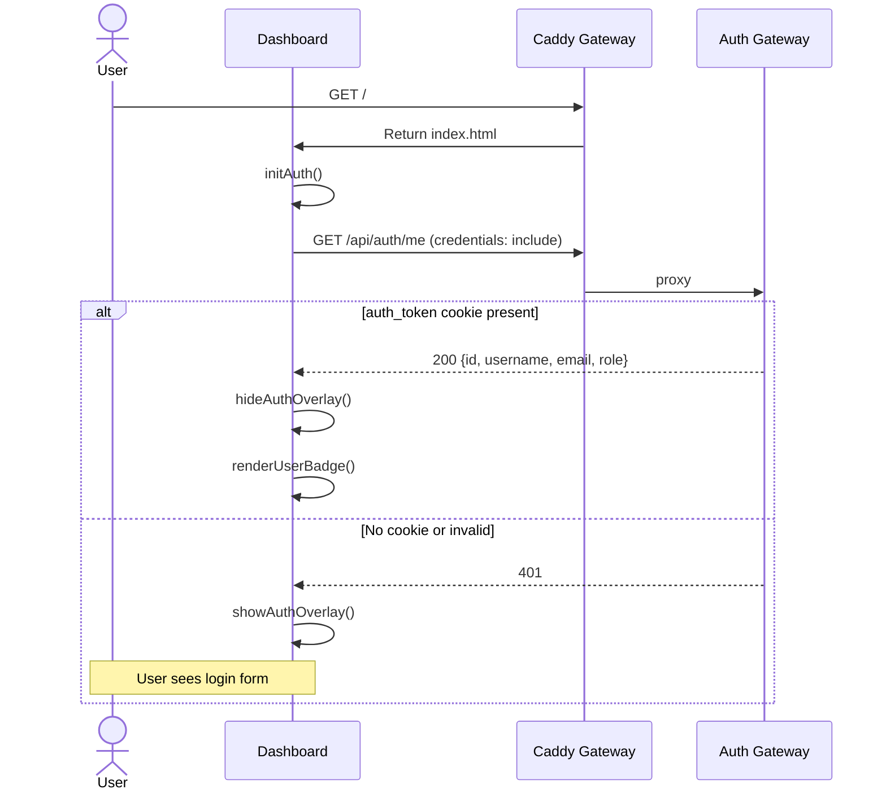

### 7.2 RBAC in Platform Context

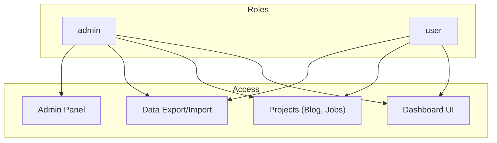

---

## 8. Docker Compose — Orchestration

### 8.1 Services

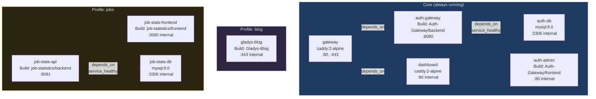

### 8.2 Docker Compose Profiles

| Profile | Services | Command |
|---------|---------|---------|
| (default) | gateway, dashboard, auth-gateway, auth-admin, auth-db | `make up` |
| `blog` | + gladys-blog, blog-admin | `make up-blog` |
| `jobs` | + job-stats-frontend, job-stats-api, job-stats-db | `make up-jobs` |
| `blog` + `jobs` | All services | `make up-all` |

### 8.3 Volumes

| Volume | Type | Container | Mount |
|--------|-----|-----------|-------|
| `caddy_data` | Named | gateway | /data |
| `caddy_config` | Named | gateway | /config |
| `auth_data` | Named | auth-db | /var/lib/mysql |
| `jobs_data` | External | job-stats-db | /var/lib/mysql |
| `blog_content` | Named | blog-admin | /blog |
| `blog_public` | Named | blog-admin (rw), gladys-blog (ro) | /blog/public, /usr/share/nginx/html |
| `./www` | Bind (ro) | gateway, dashboard | /srv/www |
| `./Caddyfile` | Bind (ro) | gateway | /etc/caddy/Caddyfile |

---

## 9. Sub-project Integration

### 9.1 How a sub-project integrates into the platform

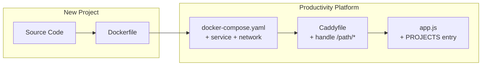

### 9.2 Project Addition Checklist

1. **Docker Compose:** add service, connect to `gateway` network, specify profile.
2. **Caddyfile:** add `handle /path/*` with `route { forward_auth + handle_response @unauthed + header_regexp permission check + 403 fallback }`.
3. **Dashboard `app.js`:** add object to `PROJECTS` and permission to `PROJECT_PERMISSIONS`.
4. **API URL:** in the sub-project, implement `basename` / API URL detection via `window.location.pathname`.

### 9.3 Gateway Mode Detection Pattern

Each sub-project checks if it is running via the Gateway:

```javascript
// Job Statistics (React)
const basename = window.location.pathname.startsWith('/jobs') ? '/jobs' : '/';
const API_BASE = basename === '/jobs' ? '/jobs/api/v1' : 'http://localhost:8081/api/v1';

// Admin Panel (Vanilla JS)
function isGatewayMode() {
  return window.location.pathname.startsWith('/admin');
}
```

---

## 10. Project Access Control (Caddy-level)

Caddy checks access at the Gateway level via `forward_auth` + `header_regexp X-Auth-Permissions`:

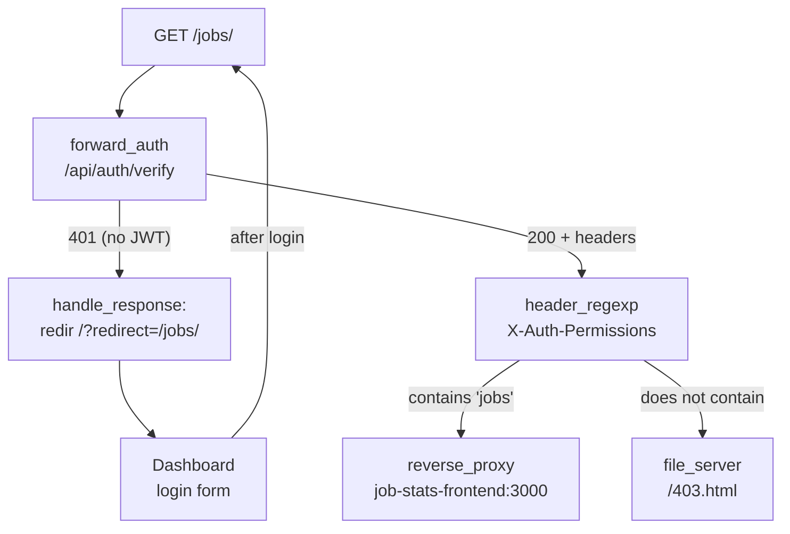

| Route | Permission | Action if present | Action if absent |
|---------|-----------|---------------------|----------------------|
| `/admin/*` | `admin` | reverse_proxy auth-admin:80 | 403.html |
| `/blog/` | `blog` | serve blog-wrapper.html | 403.html |
| `/jobs/*` | `jobs` | reverse_proxy job-stats-frontend:3000 | 403.html |
| `/chat/*` | `chat` | reverse_proxy gladys-chat-frontend:80 | 403.html |

**Blog — Exception:** uses an iframe wrapper (`blog-wrapper.html`) because Hugo does not support "← Dashboard" navigation. Other projects (React/Go SPAs) are proxied directly.

**Registration:** unified via Auth Gateway. After `/?redirect={path}`, Dashboard shows login/register form, and after successful authorization, redirects back to the project. All users are available in the admin panel.

### Connection of downstream projects to Auth DB

| Project | Connection to Auth DB | Description |
|--------|----------------|----------|
| **Gladys Chat** | `users.auth_user_id` → Auth `users.id` | Each chat is unique to the user |
| **Job Statistics** | `users.auth_user_id` → Auth `users.id` | Vacancies linked to user via `jobs.user_id` |
| **Gladys Blog** | Not required | Static content, access via `forward_auth` |

### RBAC in Job Statistics

| Entity | GET | POST/PUT/DELETE |
|----------|-----|----------------|
| **Companies, Skills, Locations** | All users | Admin only (reference data) |
| **Jobs** | Admin — all, user — only their own | Admin — any, user — only their own |
| **Stats** | All users | — (read-only) |

When a user is deleted (Auth Gateway soft delete), vacancies remain with `user_id = NULL` (ON DELETE SET NULL) — visible only to the admin.

---

## 11. External APIs

| API | Usage | File |
|-----|--------------|------|
| `api.dictionaryapi.dev` | Word definitions (en) | word-of-day.js |
| `api.mymemory.translated.net` | Translation en→ru | word-of-day.js |
| Ollama `/api/chat` | AI assistant (LLM inference) | app.js |

---

## 12. Project Availability Check

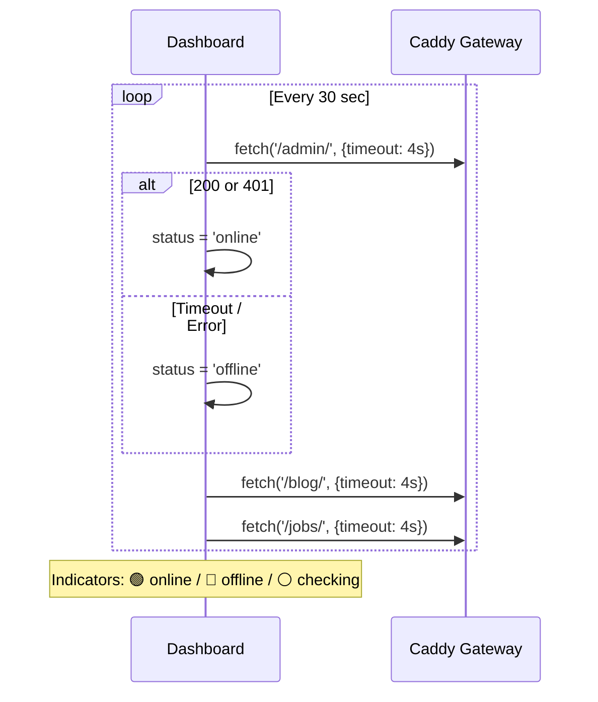

---

## 13. Makefile — Management Commands

```makefile
up              # Core: Dashboard + Auth Gateway
down            # Stop all services (all profiles)
restart         # Restart core
logs            # Follow logs (all profiles)
up-all          # ALL: core + blog + jobs + chat + sketchbook
up-blog         # Core + Gladys Blog
up-jobs         # Core + Job Statistics
up-chat         # Core + Gladys Chat
up-sketchbook   # Core + Sketchbook
quotes          # Parse quotes from markdown → quotes.json
open            # Open Dashboard in browser
build-auth      # Rebuild Auth Gateway containers
clean           # Remove all volumes and containers
status          # Show status of all services

# Job Statistics: build and tests
jobs-rebuild           # Rebuild API + Frontend (no cache)
jobs-rebuild-api       # Rebuild API only
jobs-rebuild-frontend  # Rebuild Frontend only
jobs-logs              # Job Statistics logs
jobs-test-backend      # Go backend unit tests (local)
jobs-test              # Frontend Jest tests (Docker)
jobs-test-coverage     # Jest tests + coverage
jobs-lint              # ESLint check
jobs-lint-fix          # ESLint with auto-fix
jobs-migrate           # Apply DB migrations
jobs-seed              # Load test data (DESTRUCTIVE)

# Gladys Chat: build
chat-rebuild           # Rebuild API + Frontend (no cache)
chat-rebuild-api       # Rebuild API only
chat-rebuild-frontend  # Rebuild Frontend only
chat-logs              # Gladys Chat logs
chat-migrate           # Apply DB migrations
```

---

## 14. Project Dependency Diagram


**Key Connections:**
- **Productivity → Auth-Gateway:** JWT authentication via HttpOnly cookie.
- **Productivity → Gladys-Blog:** iframe + TLS proxying (skip verify).
- **Productivity → job-statistics-platform:** URI strip prefix, external volume for data persistence.
- **All sub-projects → Productivity:** Gateway mode detection via `window.location.pathname`.
