# ARCHITECTURE.md — Productivity Dashboard (Unified Platform)

> Единая платформа-хаб для управления локальными Docker-проектами с централизованной аутентификацией, дашбордом продуктивности и интеграцией подпроектов.

---

## 1. Обзор системы

Productivity Dashboard — это оркестрирующий проект, который объединяет несколько независимых приложений под единым reverse proxy (Caddy), обеспечивает централизованную аутентификацию и предоставляет персональный дашборд продуктивности.

**Роль:** API Gateway + Dashboard UI + Infrastructure as Code
**Стек:** Caddy 2 (Gateway) · Vanilla JS (Dashboard) · Docker Compose · Make

---

## 2. Диаграмма системы (C4 — System Context)

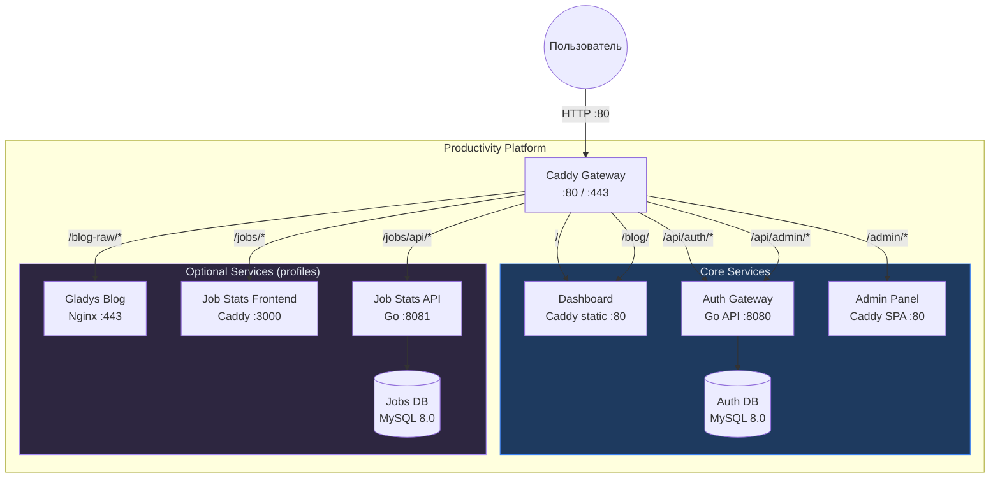

---

## 3. Структура проекта

```
Productivity/
├── docker-compose.yaml       # Единая оркестрация всех сервисов
├── Caddyfile                 # Gateway: роутинг + headers + encoding
├── DashboardCaddyfile        # Внутренний static server Dashboard
├── Makefile                  # Команды управления: up, down, up-all, logs, status
├── .env                      # Секреты: JWT_SECRET, DB credentials
├── .env.example              # Шаблон переменных окружения
├── www/                      # Статические файлы Dashboard
│   ├── index.html            # SPA: auth overlay + main content
│   ├── blog-wrapper.html     # iframe-обёртка для блога
│   ├── css/
│   │   └── style.css         # Единый файл стилей (~1700 строк)
│   ├── js/
│   │   ├── auth.js           # Аутентификация: login, register, verify
│   │   ├── app.js            # Основная логика: виджеты, TODO, расписание
│   │   ├── training-data.js  # Загрузчик CSV: план тренировок + рекорды 5 вёрст
│   │   └── word-of-day.js    # Слово дня: API + кэш + архив
│   ├── data/
│   │   ├── words.json              # Словарь для "Слова дня"
│   │   ├── training_schedule.csv   # → symlink / docker mount из 5run
│   │   └── records_sorted.csv     # → symlink / docker mount из 5run
│   └── quotes.json           # Цитаты (генерируются из markdown)
├── scripts/
│   └── parse_quotes.py       # Парсер цитат
├── docs/
│   └── auth-architecture.md  # Документация auth-архитектуры
└── CLAUDE.md                 # Инструкции для AI-ассистента
```

---

## 4. Сетевая архитектура

### 4.1 Docker Networks

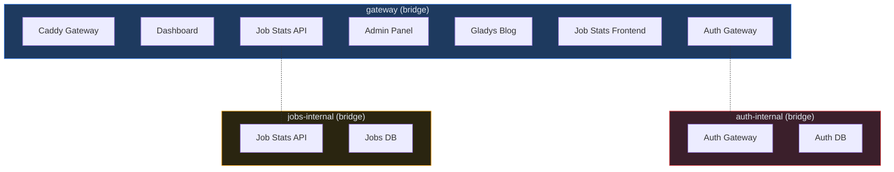

### 4.2 Изоляция сетей

| Сеть | Участники | Назначение |
|------|-----------|-----------|
| `gateway` | Все сервисы + Caddy | Маршрутизация HTTP-трафика |
| `auth-internal` | Auth Gateway + Auth DB | Изоляция БД аутентификации |
| `jobs-internal` | Job Stats API + Jobs DB | Изоляция БД вакансий |

**Принцип:** Базы данных доступны только из своей internal-сети. Gateway-сеть обеспечивает связность между фронтендами и API через Caddy.

---

## 5. Caddy Gateway — маршрутизация

### 5.1 Таблица маршрутов

```
:80 {
    /api/auth/*          → auth-gateway:8080     (public, без forward_auth)
    /api/health          → auth-gateway:8080     (probe)
    /api/admin/*         → auth-gateway:8080     (protected middleware)

    /admin/*             → auth-admin:80         (strip /admin)
    /admin               → /admin/ (redirect)

    /blog/               → /srv/www/blog-wrapper.html (iframe)
    /blog                → /blog/ (redirect)
    /blog-raw/*          → gladys-blog:443       (strip /blog-raw, TLS skip verify)
    /blog-raw            → /blog-raw/ (redirect)

    /jobs/api/*          → job-stats-api:8081    (strip /jobs)
    /jobs/*              → job-stats-frontend:3000 (strip /jobs)
    /jobs                → /jobs/ (redirect)

    /*                   → dashboard:80          (default, catch-all)
}
```

### 5.2 Диаграмма маршрутизации

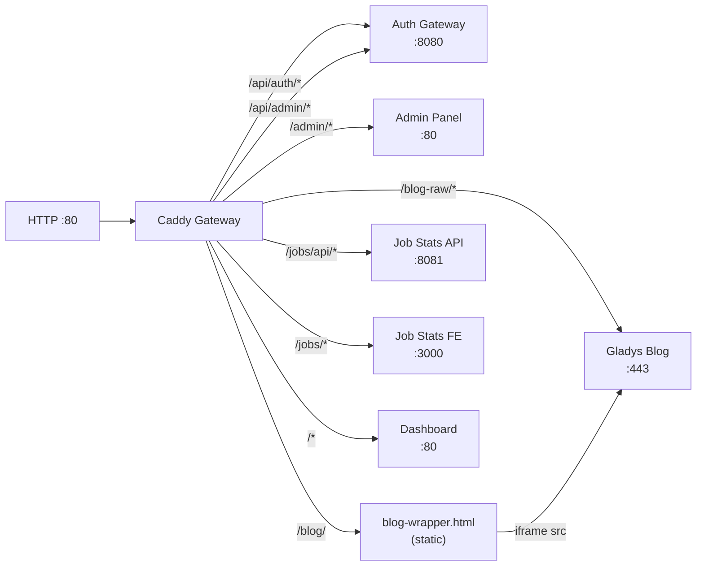

### 5.3 HTTP Headers

| Path | Header | Значение |
|------|--------|---------|
| `*` | `X-Content-Type-Options` | `nosniff` |
| `/blog-raw/*` | `X-Frame-Options` | `SAMEORIGIN` |
| `*` | `Content-Encoding` | gzip / zstd |

---

## 6. Архитектура Dashboard UI

### 6.1 Модульная структура JavaScript

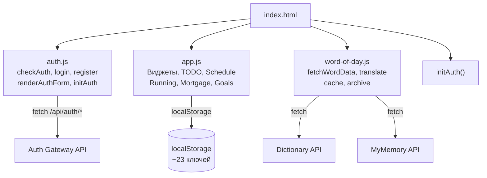

### 6.2 Порядок инициализации

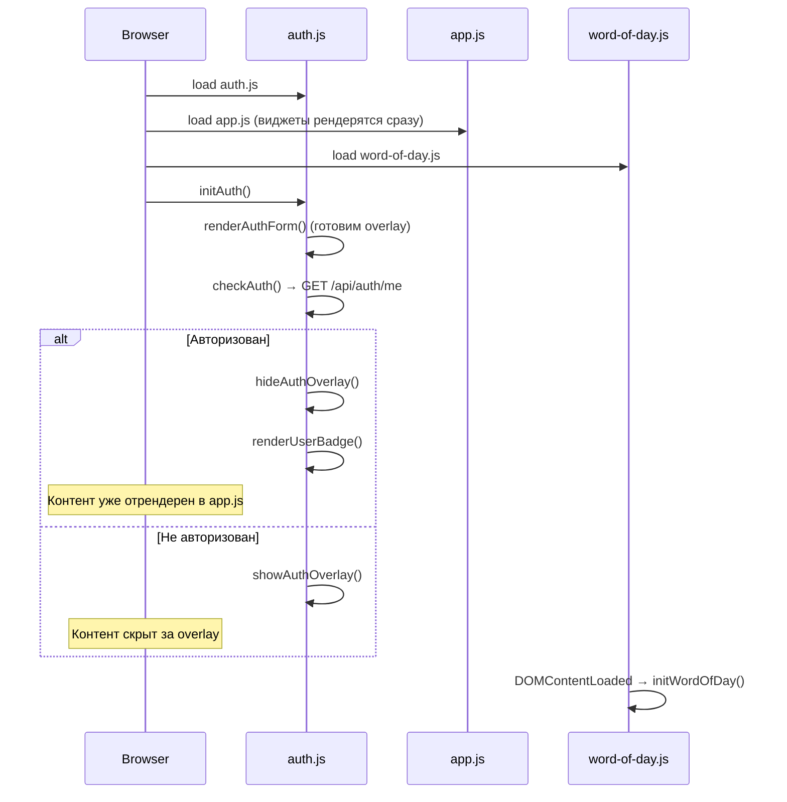

### 6.3 Компоненты Dashboard

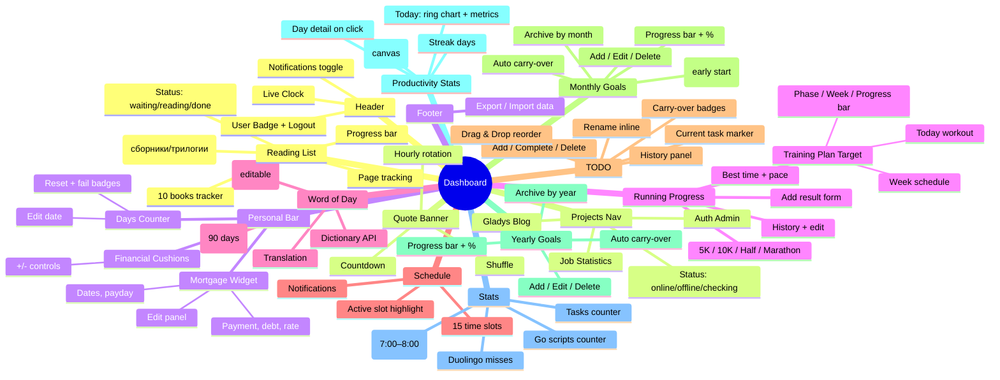

### 6.4 Хранилище данных (localStorage)

| Ключ | Тип | Описание |
|------|-----|----------|
| `prod_days_v1` | `{startDate, failCount}` | Счётчик дней без привычки |
| `prod_cushions` | `number` | Финансовые подушки |
| `prod_mortgage_v1` | `{payment, debt, rate, ...}` | Ипотека |
| `prod_notif_enabled` | `"0"\|"1"` | Уведомления вкл/выкл |
| `prod_tasks_v1` | `[{id, text, done, current, ...}]` | Задачи |
| `prod_history_v1` | `[{id, text, addedAt, doneAt, workedMs}]` | История задач |
| `prod_monthly_goals_v2` | `{monthKey: [{id, text, icon, done, recurring?, carriedFrom?}]}` | Цели на месяц (по ключу YYYY-MM) |
| `prod_yearly_goals_v2` | `{yearKey: [{id, text, icon, done, recurring?, carriedFrom?}]}` | Цели на год (по ключу YYYY) |
| `prod_daily_snapshot_v1` | `{dateStr: {completed, remaining, totalMs, ...}}` | Снимки продуктивности по дням |
| `prod_early_start_v1` | `{monthKey: {dateStr: {time, success}}}` | Трекер раннего старта 7:00–8:00 |
| `prod_stat_go` | `number` | Счётчик Go-скриптов |
| `prod_stat_tasks` | `number` | Счётчик рабочих задач |
| `prod_stat_duo` | `number` | Пропуски Duolingo |
| `prod_schedule_labels_v1` | `{index: {label, sub}}` | Пользовательские названия окон расписания |
| `prod_reading_books_v1` | `[{id, title, author, type, subItems?}]` | Список книг для чтения (пользовательский) |
| `prod_reading_v1` | `{bookId: {status, page, startedAt}}` | Прогресс чтения (включая sub-items сборников/трилогий) |
| `prod_running_v1` | `{distId: [{secs, date, addedAt}]}` | Результаты бега |
| `prod_wod_cache` | `{word, wordRu, ...}` | Кэш слова дня |
| `prod_wod_archive_v1` | `[{word, date, ...}]` | Архив слов (90 дней) |
| `prod_scratchpad_v1` | `{text, date, history: {date: text}}` | Быстрые заметки с историей по дням |
| `prod_distractions_v1` | `{dateStr: [{category, time}]}` | Лог отвлечений по дням |
| `prod_briefing_dismissed` | `"YYYY-MM-DD"` | Дата закрытия утреннего брифинга |
| `prod_retrospective_v1` | `{weekKey: {stats, note, createdAt}}` | Еженедельные ретроспективы |
| `prod_go_lessons_v1` | `{lessonId: {done, doneAt}}` | Прогресс уроков Syncthing |
| `prod_go_tour_v1` | `{exerciseId: {done, doneAt}}` | Прогресс Go Tour упражнений |
| `prod_go_code_v1` | `{itemId: {done, doneAt}}` | Прогресс изучения кода |
| `prod_go_start_date` | `"YYYY-MM-DD"` | Дата начала Go уроков |

---

## 7. Аутентификация

### 7.1 Поток авторизации Dashboard

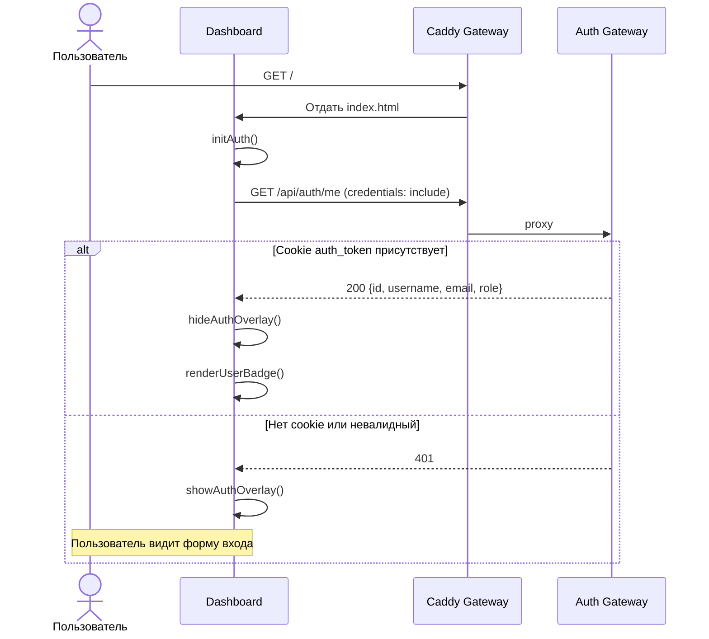

### 7.2 RBAC в контексте платформы

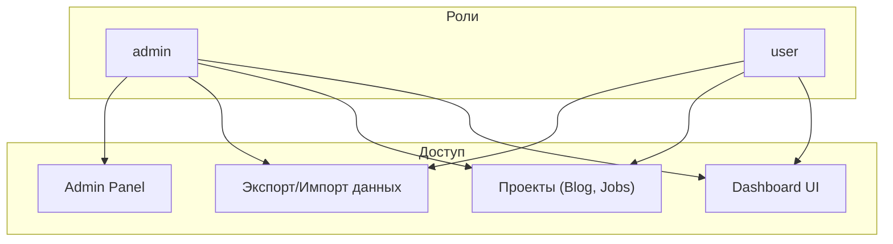

---

## 8. Docker Compose — оркестрация

### 8.1 Сервисы


### 8.2 Профили Docker Compose

| Профиль | Сервисы | Команда |
|---------|---------|---------|
| (default) | gateway, dashboard, auth-gateway, auth-admin, auth-db | `make up` |
| `blog` | + gladys-blog | `make up-blog` |
| `jobs` | + job-stats-frontend, job-stats-api, job-stats-db | `make up-jobs` |
| `blog` + `jobs` | Все сервисы | `make up-all` |

### 8.3 Volumes

| Volume | Тип | Контейнер | Mount |
|--------|-----|-----------|-------|
| `caddy_data` | Named | gateway | /data |
| `caddy_config` | Named | gateway | /config |
| `auth_data` | Named | auth-db | /var/lib/mysql |
| `jobs_data` | External | job-stats-db | /var/lib/mysql |
| `./www` | Bind (ro) | gateway, dashboard | /srv/www |
| `./Caddyfile` | Bind (ro) | gateway | /etc/caddy/Caddyfile |

---

## 9. Интеграция подпроектов

### 9.1 Как подпроект интегрируется в платформу

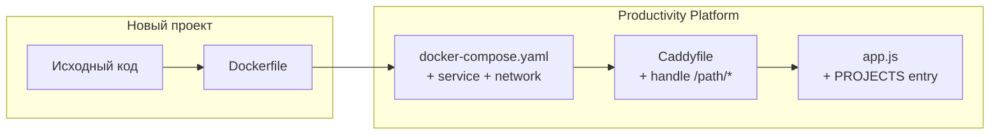

### 9.2 Чеклист добавления проекта

1. **Docker Compose:** добавить сервис, подключить к `gateway` network, указать profile
2. **Caddyfile:** добавить `handle /path/*` с `uri strip_prefix` и `reverse_proxy`
3. **Dashboard `app.js`:** добавить объект в массив `PROJECTS`
4. **Навигация:** в подпроекте добавить "← Dashboard" ссылку при обнаружении gateway-режима
5. **API URL:** в подпроекте реализовать определение `basename` / API URL по `window.location.pathname`

### 9.3 Паттерн обнаружения Gateway-режима

Каждый подпроект проверяет, запущен ли он через Gateway:

```javascript
// Job Statistics (React)
const basename = window.location.pathname.startsWith('/jobs') ? '/jobs' : '/';
const API_BASE = basename === '/jobs' ? '/jobs/api/v1' : 'http://localhost:8081/api/v1';

// Admin Panel (Vanilla JS)
function isGatewayMode() {
  return window.location.pathname.startsWith('/admin');
}
```

---

## 10. Блог-обёртка (iframe pattern)

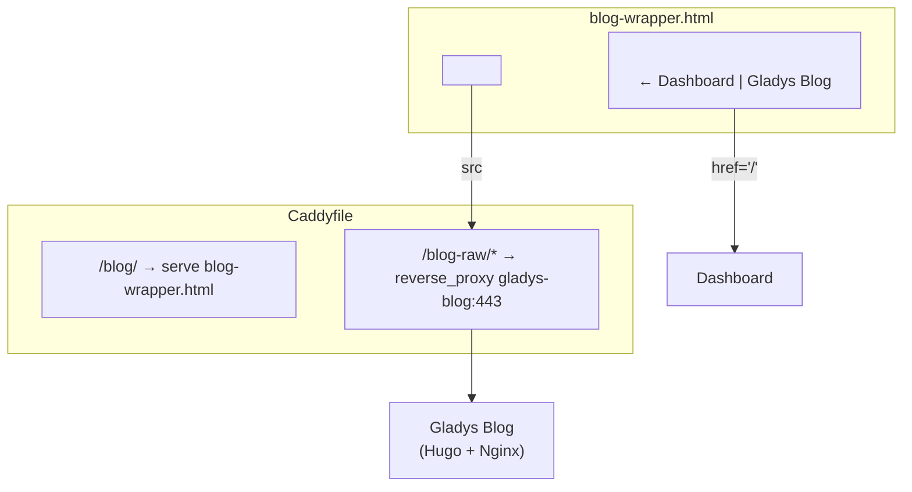

**Зачем iframe:** Стили блога (GitHub-style тема) конфликтуют с Dashboard CSS. iframe обеспечивает полную изоляцию стилей, при этом навигационная панель принадлежит Dashboard.

---

## 11. Внешние API

| API | Использование | Файл |
|-----|--------------|------|
| `api.dictionaryapi.dev` | Определения слов (en) | word-of-day.js |
| `api.mymemory.translated.net` | Перевод en→ru | word-of-day.js |

---

## 12. Проверка доступности проектов

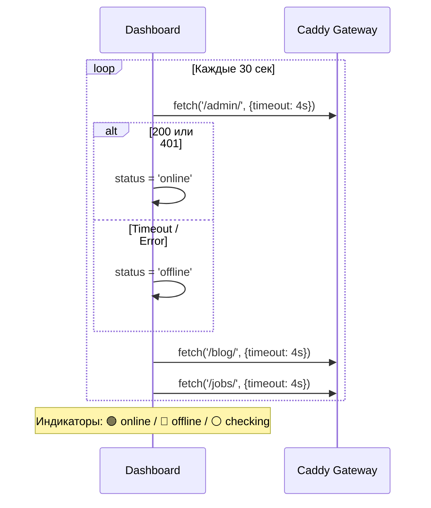

---

## 13. Makefile — команды управления

```makefile
up          # Core: Dashboard + Auth Gateway
down        # Stop all services (all profiles)
restart     # Restart core
logs        # Follow logs (all profiles)
up-all      # ALL: core + blog + jobs
up-blog     # Core + Gladys Blog
up-jobs     # Core + Job Statistics
quotes      # Parse quotes from markdown → quotes.json
open        # Open Dashboard in browser
build-auth  # Rebuild Auth Gateway containers
clean       # Remove all volumes and containers
status      # Show status of all services
```

---

## 14. Диаграмма зависимостей между проектами

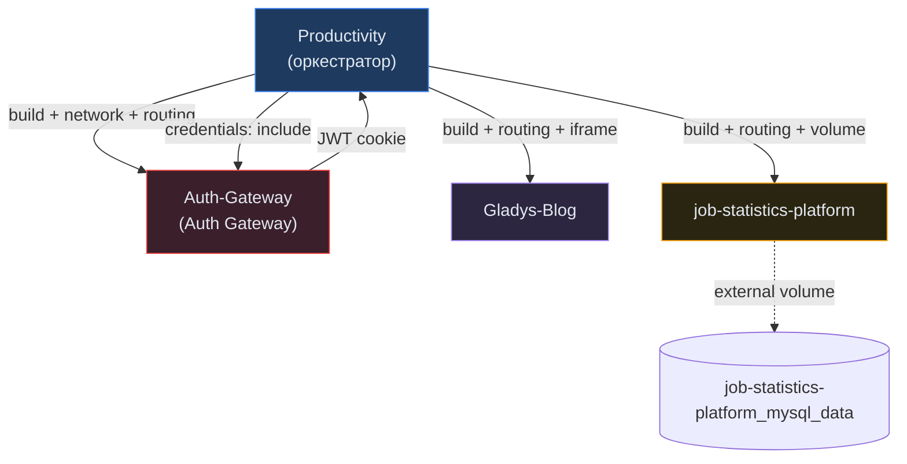

**Ключевые связи:**
- **Productivity → Auth-Gateway:** JWT-аутентификация через HttpOnly cookie
- **Productivity → Gladys-Blog:** iframe + TLS-проксирование (skip verify)
- **Productivity → job-statistics-platform:** URI strip prefix, external volume для сохранения данных
- **Все подпроекты → Productivity:** Обнаружение gateway-режима по `window.location.pathname`
