# План миграции на микросервисную архитектуру

> Поэтапный план перехода Productivity Platform с монолитно-модульной архитектуры на полноценную микросервисную архитектуру с применением best practices и паттернов.

---

## 1. Текущее состояние (AS-IS)

### 1.1 Архитектурный стиль: Modular Monolith + Shared Gateway

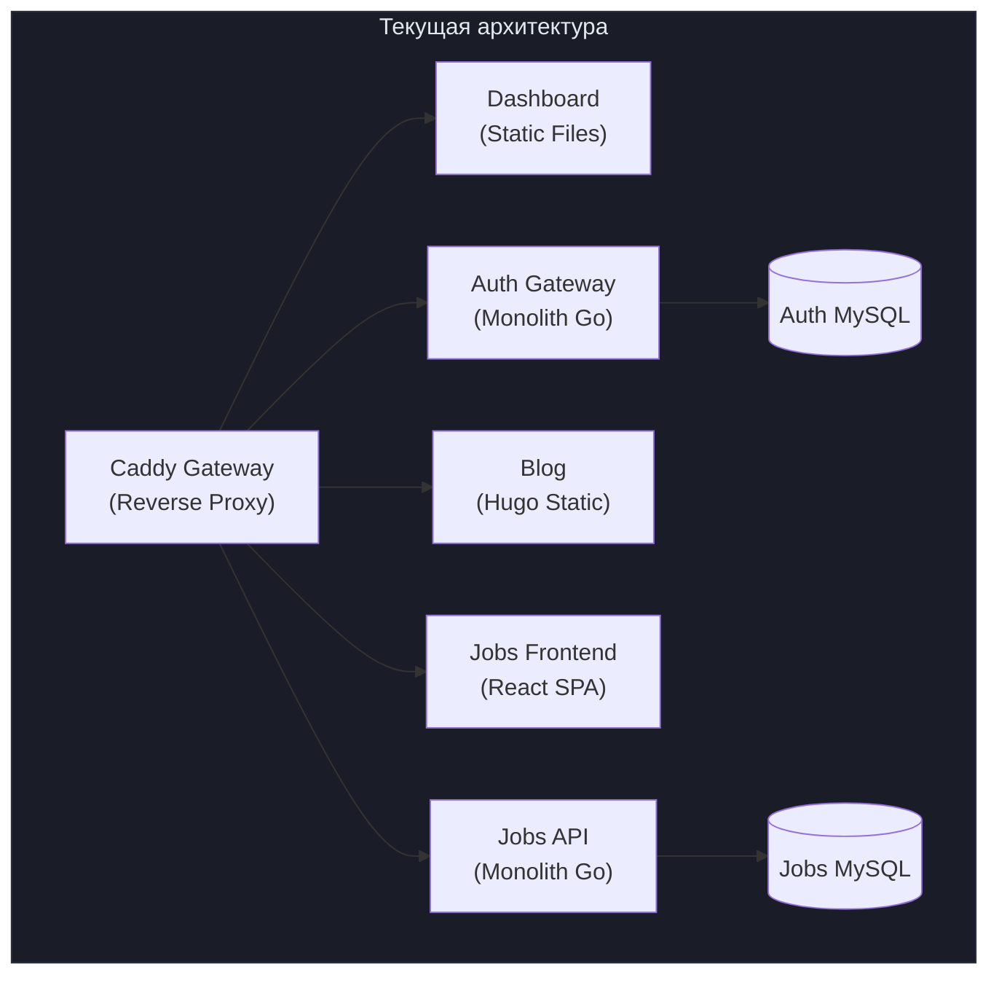

### 1.2 Проблемы текущей архитектуры

| Проблема | Описание | Влияние |
|----------|----------|---------|
| **Синхронная связность** | Dashboard напрямую вызывает Auth API | Каскадные отказы |
| **Нет Service Discovery** | Хардкод имён контейнеров в Caddyfile | Невозможность масштабирования |
| **Единая точка отказа** | Caddy Gateway — SPOF | Вся платформа недоступна |
| **Нет observability** | Логи только в stdout, нет метрик | Сложная отладка |
| **localStorage** | Данные Dashboard в браузере | Потеря при смене origin |
| **Общий Docker Compose** | Все сервисы в одном файле | Сложный деплой |
| **Нет API versioning** | Только `/api/v1` в Jobs | Сложность эволюции API |
| **Нет circuit breaker** | Прямые HTTP-вызовы | Каскадные отказы |
| **Monolith Auth** | Auth = API + Admin UI + Sessions | Нельзя масштабировать отдельно |

---

## 2. Целевое состояние (TO-BE)

### 2.1 Архитектурный стиль: Microservices + Event-Driven

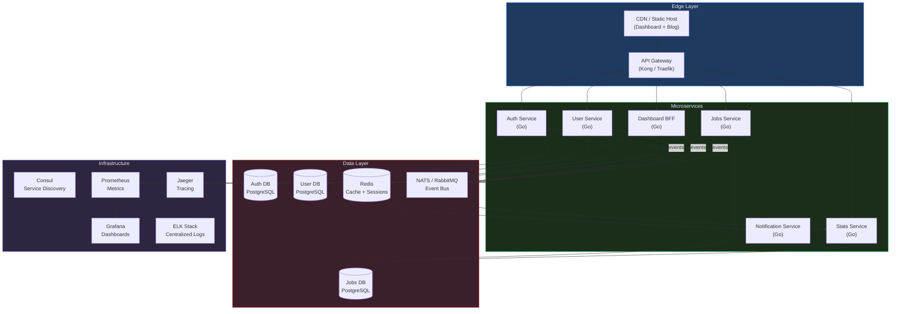

---

## 3. Применяемые паттерны микросервисной архитектуры

### 3.1 Каталог паттернов

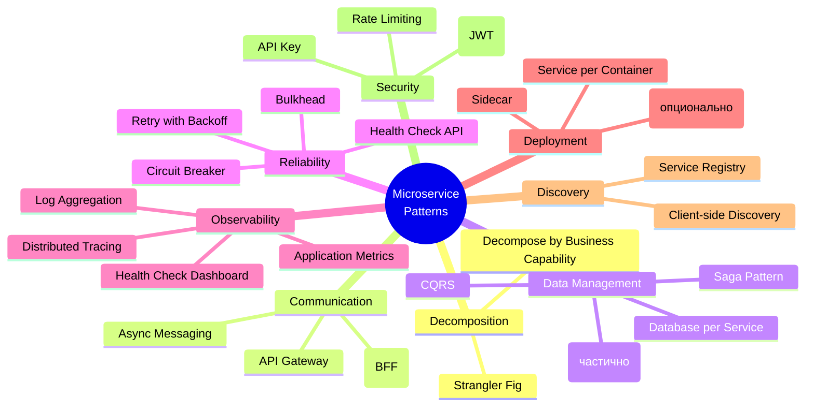

### 3.2 Подробное описание паттернов

#### 3.2.1 Strangler Fig Pattern (основа миграции)

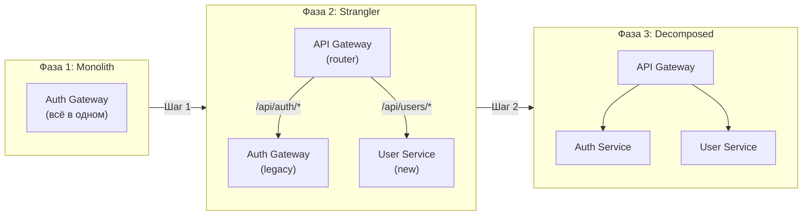

**Применение:** Auth Gateway содержит как auth-логику, так и admin CRUD пользователей. Разделяем на Auth Service (только аутентификация) и User Service (управление пользователями).

#### 3.2.2 API Gateway Pattern

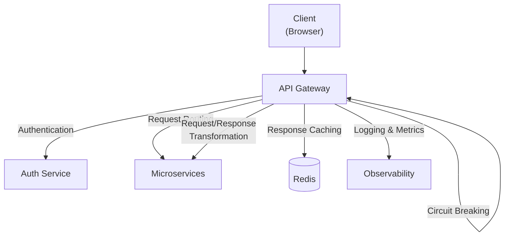

**Реализация:** Замена Caddy на Kong или Traefik с поддержкой:
- JWT-валидация на уровне Gateway
- Rate limiting per-endpoint
- Circuit breaker для downstream сервисов
- Request ID propagation

#### 3.2.3 Backend for Frontend (BFF)

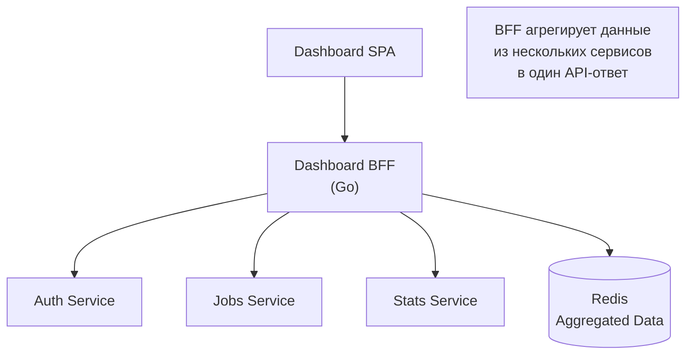

**Применение:** Dashboard сейчас хранит данные в localStorage. BFF позволит:
- Серверное хранение пользовательских данных (задачи, прогресс бега, ипотека)
- Агрегация данных из нескольких сервисов в один запрос
- Server-Side Rendering (опционально)

#### 3.2.4 Database per Service

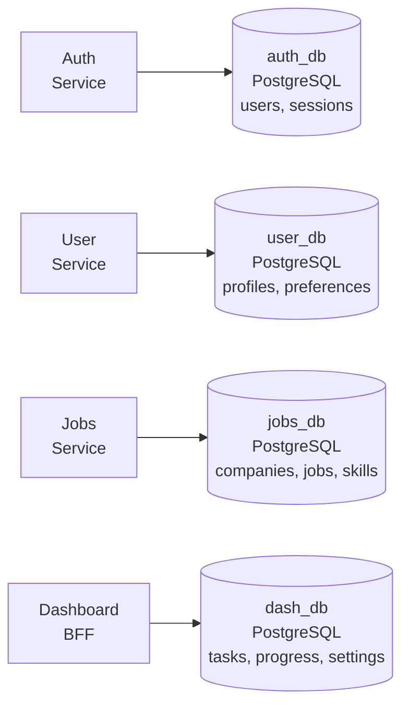

**Принцип:** Каждый сервис владеет своей базой данных. Другие сервисы взаимодействуют только через API или события.

#### 3.2.5 CQRS (Command Query Responsibility Segregation)

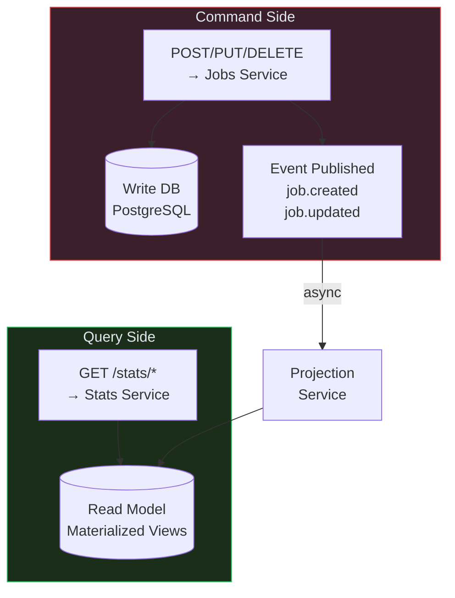

**Применение:** Stats Service в Job Statistics выполняет тяжёлые агрегации (GROUP BY, JOIN). При CQRS:
- Write: Jobs Service обрабатывает CRUD
- Read: Stats Service читает из предвычисленных materialized views
- Проекция: Асинхронное обновление views при изменении данных

#### 3.2.6 Event-Driven Architecture

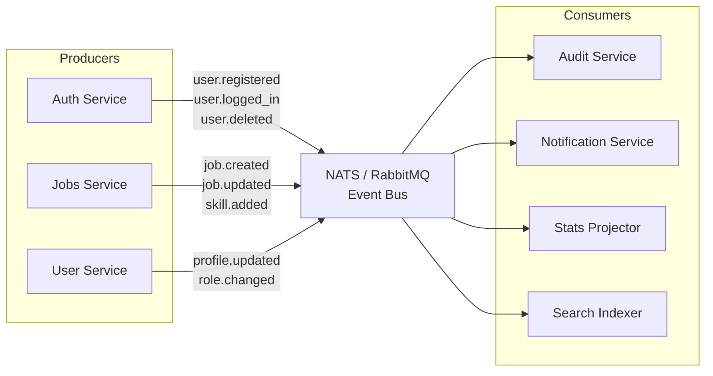

**Формат события:**

```json
{
  "id": "evt_abc123",
  "type": "user.registered",
  "source": "auth-service",
  "time": "2026-03-15T13:00:00Z",
  "data": {
    "user_id": 42,
    "username": "friedfox",
    "email": "user@example.com"
  },
  "metadata": {
    "correlation_id": "req_xyz789",
    "trace_id": "trace_456"
  }
}
```

#### 3.2.7 Circuit Breaker

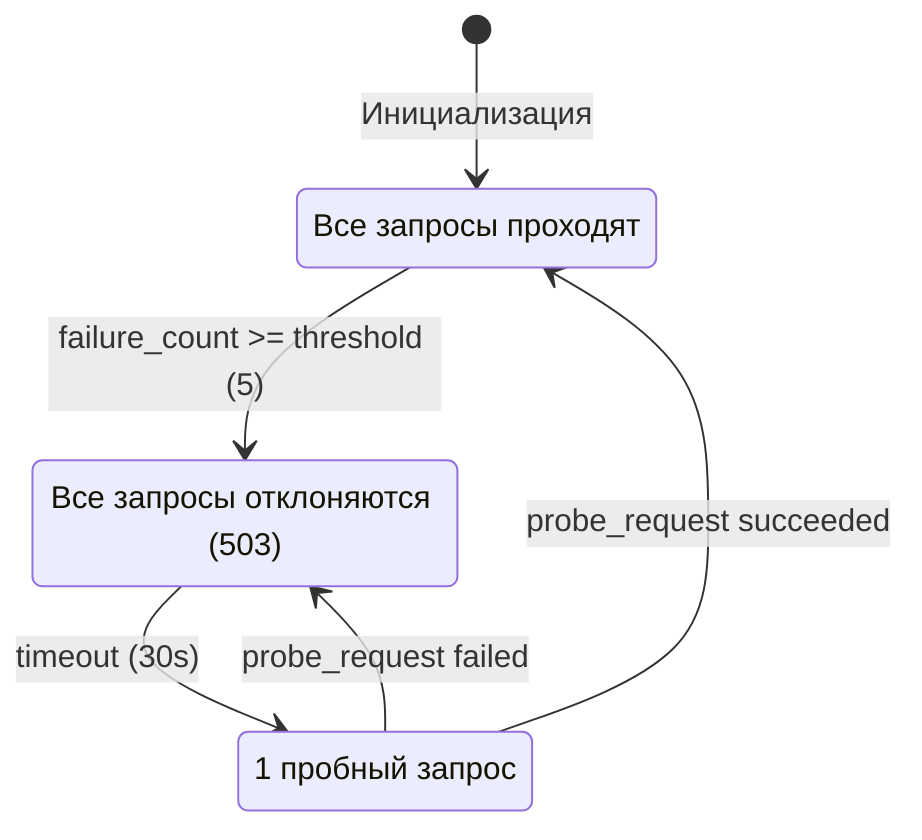

**Применение:** Dashboard BFF использует circuit breaker при вызове каждого downstream сервиса.

#### 3.2.8 Saga Pattern

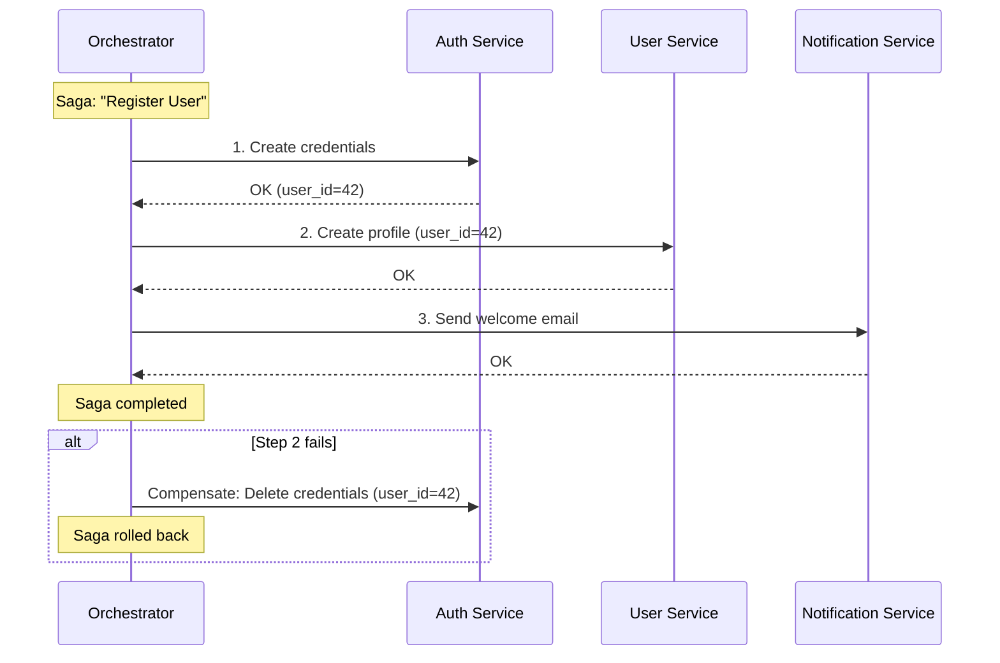

**Применение:** Регистрация пользователя затрагивает Auth Service (credentials) + User Service (profile). Saga обеспечивает согласованность без распределённых транзакций.

---

## 4. Целевая декомпозиция сервисов

### 4.1 Bounded Contexts (DDD)

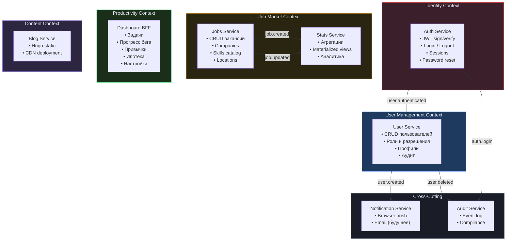

### 4.2 Контракты между сервисами

| Producer | Consumer | Событие | Данные |
|----------|----------|---------|--------|
| Auth Service | Audit Service | `auth.login` | user_id, ip, timestamp |
| Auth Service | Audit Service | `auth.logout` | user_id, ip |
| Auth Service | Audit Service | `auth.login_failed` | email, ip |
| User Service | Notification Service | `user.created` | user_id, email |
| User Service | Audit Service | `user.deleted` | user_id, admin_id |
| User Service | Audit Service | `user.role_changed` | user_id, old_role, new_role |
| Jobs Service | Stats Service | `job.created` | job_id, company_id, skills[] |
| Jobs Service | Stats Service | `job.updated` | job_id, changed_fields |
| Jobs Service | Stats Service | `job.deleted` | job_id |

### 4.3 API-контракты целевых сервисов

```
Auth Service (:8001)
  POST /auth/register        → {token, user_id}
  POST /auth/login           → {token, user_id}
  POST /auth/logout          → {status}
  GET  /auth/verify          → {user_id, role} + headers
  POST /auth/refresh         → {token}
  POST /auth/password/reset  → {status}

User Service (:8002)
  GET    /users              → [User]
  GET    /users/{id}         → User
  POST   /users              → User
  DELETE /users/{id}         → {status}
  PATCH  /users/{id}/role    → {status}
  GET    /users/{id}/profile → UserProfile
  PUT    /users/{id}/profile → UserProfile

Jobs Service (:8003)
  GET/POST/PUT/DELETE /companies
  GET/POST/PUT/DELETE /jobs
  GET/POST/PUT/DELETE /skills
  POST /jobs/{id}/skills     → {status}

Stats Service (:8004) [Read-Only]
  GET /stats/top-skills
  GET /stats/salaries
  GET /stats/companies
  GET /stats/databases
  GET /stats/languages

Dashboard BFF (:8005)
  GET/PUT    /me/tasks       → [Task]
  GET/PUT    /me/running     → RunningProgress
  GET/PUT    /me/habits      → HabitData
  GET/PUT    /me/mortgage    → MortgageData
  GET/PUT    /me/settings    → UserSettings
  GET        /me/dashboard   → AggregatedDashboard

Notification Service (:8006)
  POST /notifications/subscribe   → {status}
  POST /notifications/send        → {status}

Audit Service (:8007) [Internal Only]
  GET /audit/log             → [AuditEntry]
  GET /audit/stats           → AuditStats
```

---

## 5. Целевая модель данных

### 5.1 Auth DB (PostgreSQL)

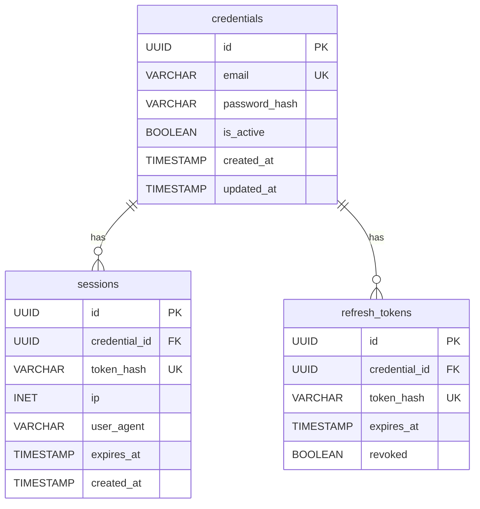

### 5.2 User DB (PostgreSQL)

```mermaid
erDiagram
    users {
        UUID id PK "same as credentials.id"
        VARCHAR username UK
        VARCHAR display_name
        ENUM role "admin, user"
        JSONB preferences
        TIMESTAMP created_at
        TIMESTAMP deleted_at
    }

    user_profiles {
        UUID id PK
        UUID user_id FK UK
        TEXT bio
        VARCHAR avatar_url
        JSONB metadata
    }

    users ||--o| user_profiles : "has"
```

### 5.3 Dashboard DB (PostgreSQL)

```mermaid
erDiagram
    tasks {
        UUID id PK
        UUID user_id FK
        VARCHAR text
        BOOLEAN done
        BOOLEAN current
        DATE added_date
        TIMESTAMP done_at
        INT sort_order
    }

    running_results {
        UUID id PK
        UUID user_id FK
        ENUM distance "5km, 10km, half, marathon"
        INT time_seconds
        DATE run_date
        TIMESTAMP created_at
    }

    habits {
        UUID id PK
        UUID user_id FK UK
        DATE start_date
        INT fail_count
    }

    user_settings {
        UUID id PK
        UUID user_id FK UK
        JSONB mortgage_data
        INT cushion_count
        JSONB goals_checked
        JSONB reading_progress
        JSONB stats_counters
    }

    tasks }o--|| users : "belongs to"
    running_results }o--|| users : "belongs to"
    habits ||--|| users : "belongs to"
    user_settings ||--|| users : "belongs to"
```

---

## 6. Инфраструктура

### 6.1 Целевой Docker Compose

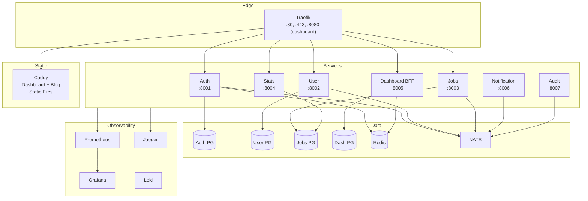

### 6.2 Observability Stack

| Компонент | Технология | Назначение |
|-----------|-----------|-----------|
| Метрики | Prometheus + Grafana | CPU, memory, request rate, error rate, latency |
| Логирование | Loki + Promtail | Centralized structured logs (JSON) |
| Трассировка | Jaeger (OpenTelemetry) | Distributed request tracing |
| Alerting | Grafana Alerting | Slack/Email оповещения |
| Health | `/health` + `/ready` | Liveness + Readiness probes |

### 6.3 Health Check Protocol

Каждый сервис экспортирует два эндпоинта:

```
GET /health  → 200 { "status": "ok" }             # Liveness: процесс жив
GET /ready   → 200 { "status": "ready" }           # Readiness: готов к трафику
              → 503 { "status": "not_ready",        # Не готов (DB недоступна)
                      "checks": { "db": "fail" } }
```

---

## 7. Поэтапный план миграции

### 7.1 Gantt-диаграмма

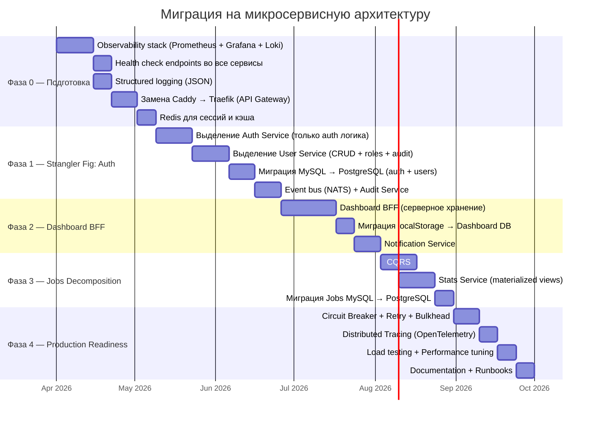

### 7.2 Описание фаз

#### Фаза 0 — Подготовка инфраструктуры (5 недель)

**Цель:** Заложить фундамент observability и API Gateway до начала декомпозиции.

| Шаг | Задача | Паттерн | Результат |
|-----|--------|---------|-----------|
| 0.1 | Развернуть Prometheus + Grafana + Loki | Log Aggregation, Application Metrics | Мониторинг всех сервисов |
| 0.2 | Добавить `/health` и `/ready` во все Go-сервисы | Health Check API | Автоматическое обнаружение проблем |
| 0.3 | Перевести логи на JSON (structured logging) | Log Aggregation | Парсинг логов в Loki |
| 0.4 | Заменить Caddy Gateway на Traefik | API Gateway | Rate limiting, JWT-валидация на уровне Gateway |
| 0.5 | Добавить Redis | Externalized Session Store | Сессии не в MySQL, отказоустойчивость |

**Критерий готовности:** Grafana-дашборд показывает метрики всех сервисов, логи агрегированы в Loki.

#### Фаза 1 — Strangler Fig: Auth (7 недель)

**Цель:** Разделить монолитный Auth Gateway на два независимых сервиса.

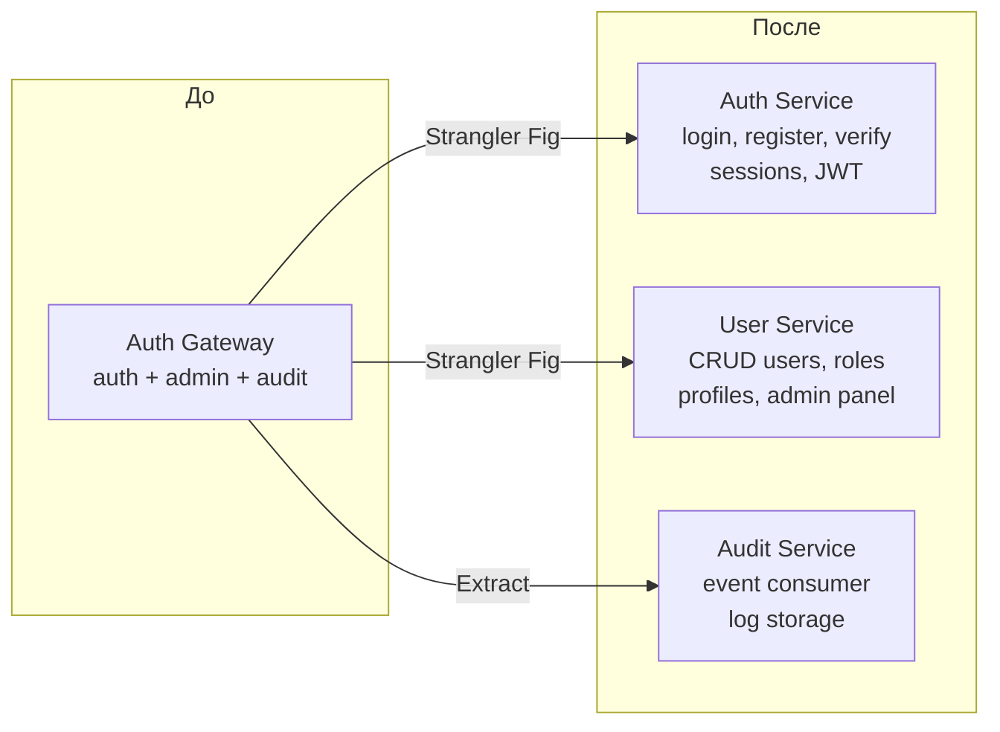

| Шаг | Задача | Паттерн | Риски |
|-----|--------|---------|-------|
| 1.1 | Выделить Auth Service (register, login, verify, logout) | Strangler Fig | Обратная совместимость API |
| 1.2 | Выделить User Service (CRUD, roles, admin panel) | Decompose by Business Capability | Дублирование данных |
| 1.3 | Миграция MySQL → PostgreSQL | Database per Service | Downtime при миграции |
| 1.4 | NATS + Audit Service (event consumer) | Event-Driven, Async Messaging | Eventual consistency |

**Критерий готовности:** Auth и User — отдельные контейнеры с отдельными БД. Audit заполняется через события.

#### Фаза 2 — Dashboard BFF (5 недель)

**Цель:** Перенести данные пользователя из localStorage на сервер.

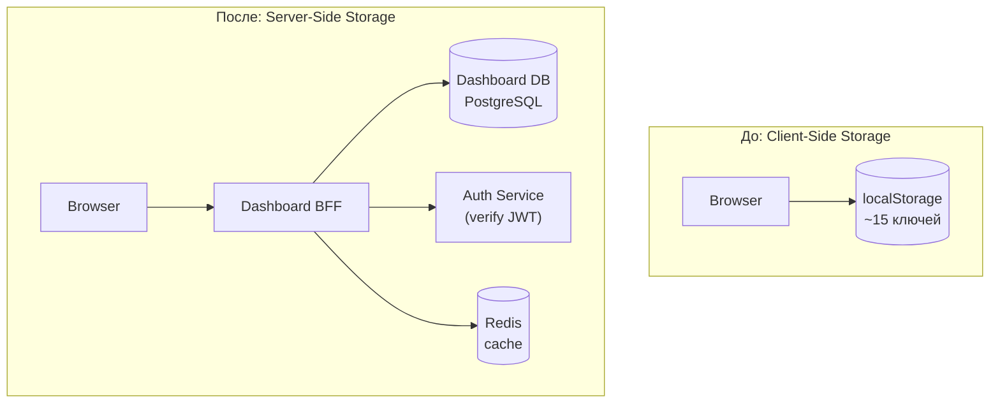

| Шаг | Задача | Паттерн | Результат |
|-----|--------|---------|-----------|
| 2.1 | Создать Dashboard BFF с API для задач, бега, привычек, ипотеки | Backend for Frontend | Серверное хранение |
| 2.2 | Миграция localStorage → Dashboard DB | Data Migration | Данные не теряются при смене origin |
| 2.3 | Notification Service (browser push через события) | Event-Driven, Async Messaging | Расписание и задачи |

**Критерий готовности:** Dashboard работает с BFF API. localStorage используется только как offline-кэш.

#### Фаза 3 — Jobs Decomposition (5 недель)

**Цель:** Разделить CRUD и аналитику в Job Statistics.

| Шаг | Задача | Паттерн | Результат |
|-----|--------|---------|-----------|
| 3.1 | Разделить Jobs API на Write (CRUD) и Read (Stats) | CQRS | Независимое масштабирование |
| 3.2 | Stats Service с materialized views | CQRS Read Model | Мгновенные ответы на агрегации |
| 3.3 | Миграция MySQL → PostgreSQL | Database per Service | Единая СУБД на платформе |

#### Фаза 4 — Production Readiness (4 недели)

| Шаг | Задача | Паттерн | Результат |
|-----|--------|---------|-----------|
| 4.1 | Circuit Breaker + Retry + Bulkhead | Reliability Patterns | Устойчивость к отказам |
| 4.2 | OpenTelemetry (distributed tracing) | Distributed Tracing | Сквозная трассировка |
| 4.3 | Нагрузочное тестирование (k6 / vegeta) | Performance Testing | SLO/SLA определены |
| 4.4 | Документация + Runbooks | Operational Excellence | Поддержка в production |

---

## 8. Стандарты разработки микросервисов

### 8.1 Шаблон Go-микросервиса

```
service-name/
├── cmd/
│   └── server/
│       └── main.go           # Инициализация, graceful shutdown
├── internal/
│   ├── config/               # Env-based config
│   ├── domain/               # Business entities
│   ├── repository/           # Database access (interface + impl)
│   ├── service/              # Business logic
│   ├── handler/              # HTTP handlers
│   ├── middleware/            # Auth, logging, metrics
│   └── event/                # Event publisher/consumer
├── pkg/
│   ├── health/               # Health check utilities
│   └── logger/               # Structured logger
├── migrations/               # SQL migrations (goose)
├── Dockerfile
├── go.mod
└── .env.example
```

### 8.2 Стандартные middleware для каждого сервиса

```go
// Порядок: снаружи → внутрь
handler = middleware.Recovery(handler)         // 1. Panic recovery
handler = middleware.RequestID(handler)        // 2. X-Request-ID
handler = middleware.Logger(handler)           // 3. Structured logging
handler = middleware.Metrics(handler)          // 4. Prometheus metrics
handler = middleware.Tracing(handler)          // 5. OpenTelemetry span
handler = middleware.CORS(handler)             // 6. CORS headers
handler = middleware.RateLimit(handler)        // 7. Per-IP rate limiting
```

### 8.3 Стандартные метрики (Prometheus)

```
http_requests_total{method, path, status}     # Счётчик запросов
http_request_duration_seconds{method, path}   # Гистограмма latency
http_requests_in_flight{service}              # Gauge текущих запросов
db_connections_active{service}                # Gauge активных подключений
event_published_total{type}                   # Счётчик опубликованных событий
event_consumed_total{type, status}            # Счётчик обработанных событий
```

---

## 9. Стратегия миграции данных

### 9.1 MySQL → PostgreSQL

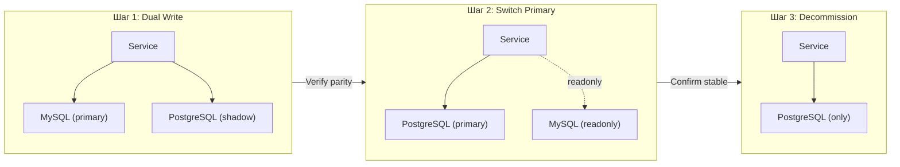

### 9.2 localStorage → Dashboard DB

```mermaid
sequenceDiagram
    participant B as Browser
    participant BFF as Dashboard BFF
    participant DB as Dashboard DB

    Note over B: Первый вход после миграции
    B->>BFF: GET /me/dashboard
    BFF-->>B: 404 (нет данных)

    B->>B: Проверить localStorage
    alt Есть данные в localStorage
        B->>BFF: POST /me/migrate {tasks, running, habits, ...}
        BFF->>DB: INSERT user data
        BFF-->>B: 200 {migrated: true}
        B->>B: localStorage.setItem('migrated', 'true')
    end

    Note over B: Последующие входы
    B->>BFF: GET /me/dashboard
    BFF->>DB: SELECT user data
    BFF-->>B: 200 {tasks, running, habits, ...}
```

---

## 10. Оценка рисков

| Риск | Вероятность | Влияние | Митигация |
|------|-------------|---------|-----------|
| Увеличение latency (network hops) | Высокая | Среднее | Redis кэш, BFF агрегация |
| Eventual consistency (события) | Высокая | Низкое | Idempotent consumers, retry |
| Операционная сложность | Высокая | Высокое | Observability с Фазы 0, runbooks |
| Потеря данных при миграции БД | Средняя | Высокое | Dual-write, backup перед миграцией |
| Complexity overhead для solo-dev | Высокая | Среднее | Поэтапный подход, не все фазы обязательны |
| Debugging distributed systems | Высокая | Среднее | Distributed tracing, correlation IDs |

---

## 11. Критерии принятия решения о фазах

Не все фазы обязательны. Принимайте решение на основе текущих потребностей:

```mermaid
flowchart TB
    Q1{"Нужна ли<br/>observability?"}
    Q2{"Теряются ли данные<br/>при смене порта?"}
    Q3{"Нужно ли масштабировать<br/>Stats отдельно?"}
    Q4{"Планируется ли<br/>production-деплой?"}

    Q1 -->|"Да"| F0["Фаза 0: Observability"]
    Q1 -->|"Нет"| Q2
    Q2 -->|"Да"| F2["Фаза 2: Dashboard BFF"]
    Q2 -->|"Нет"| Q3
    Q3 -->|"Да"| F3["Фаза 3: CQRS"]
    Q3 -->|"Нет"| Q4
    Q4 -->|"Да"| F4["Фаза 4: Reliability"]
    Q4 -->|"Нет"| STOP["Текущая архитектура<br/>достаточна"]

    F0 --> F1["Фаза 1: Strangler Fig"]
    F1 --> F2
    F2 --> F3
    F3 --> F4
```

**Рекомендация для solo-developer:** Начните с Фазы 0 (observability) и Фазы 2 (Dashboard BFF). Это решает реальные проблемы (потеря данных, отладка) без чрезмерной сложности. Фазы 1, 3, 4 — по мере роста нагрузки или команды.

---

## 12. Глоссарий

| Термин | Определение |
|--------|------------|
| **API Gateway** | Единая точка входа для всех клиентских запросов, выполняющая маршрутизацию, аутентификацию и rate limiting |
| **BFF** | Backend for Frontend — серверный слой, оптимизированный для конкретного UI |
| **Bounded Context** | Граница, в которой определённая модель предметной области применима и консистентна |
| **Circuit Breaker** | Паттерн защиты от каскадных отказов: прерывает вызовы к неисправному сервису |
| **CQRS** | Разделение модели чтения и записи для независимого масштабирования |
| **Event Sourcing** | Хранение состояния как последовательности событий, а не текущего snapshot |
| **Saga** | Паттерн управления распределёнными транзакциями через последовательность локальных транзакций с компенсациями |
| **Strangler Fig** | Постепенная замена монолита микросервисами, перехватывая запросы на уровне proxy |
| **Service Mesh** | Инфраструктурный слой для управления inter-service communication (Istio, Linkerd) |
| **Eventual Consistency** | Гарантия, что все реплики данных со временем станут консистентными |

---

## 13. Рекомендуемая литература

### 13.1 Основная литература

Книги упорядочены от базовых к продвинутым. Каждая покрывает конкретные паттерны из данного плана миграции.

| # | Книга | Автор | Год | Покрывает паттерны | Описание |
|---|-------|-------|-----|-------------------|----------|
| 1 | **Microservices Patterns** | Chris Richardson | 2018 | API Gateway, CQRS, Saga, Event Sourcing, Database per Service, Circuit Breaker, Strangler Fig | Главная книга по теме — содержит все паттерны из этого плана с подробными примерами. Сопровождается онлайн-каталогом [microservices.io](https://microservices.io) |
| 2 | **Building Microservices** (2nd edition) | Sam Newman | 2021 | Decomposition, Service Discovery, BFF, Event-Driven, Strangler Fig | Широкий обзор микросервисной архитектуры от эксперта ThoughtWorks. Второе издание существенно обновлено и актуально |
| 3 | **Designing Data-Intensive Applications** | Martin Kleppmann | 2017 | Event Sourcing, CQRS, Eventual Consistency, Distributed Transactions, Replication, Partitioning | Глубокое понимание работы с данными в распределённых системах — фундамент для корректной реализации фаз 1–3 |
| 4 | **Domain-Driven Design Distilled** | Vaughn Vernon | 2016 | Bounded Context, Aggregate, Context Map, Ubiquitous Language | Компактное (150 стр.) введение в DDD — необходимо для правильной декомпозиции монолита на сервисы |

### 13.2 Дополнительная литература

| # | Книга | Автор | Год | Фокус |
|---|-------|-------|-----|-------|
| 5 | **Release It!** (2nd edition) | Michael Nygard | 2018 | Circuit Breaker, Bulkhead, Retry, Timeout, Steady State — все паттерны надёжности из Фазы 4 |
| 6 | **Production-Ready Microservices** | Susan Fowler | 2017 | Observability, health checks, alerting, on-call — практики из Фазы 0 |
| 7 | **Cloud Native Go** | Matthew Titmus | 2021 | Практическая реализация микросервисов на Go: gRPC, service mesh, observability, resilience — ближе всего к стеку данного проекта |

### 13.3 Соответствие книг фазам миграции

```
Фаза 0 (Observability)      → Production-Ready Microservices (Fowler)
                             → Cloud Native Go (Titmus), гл. 11–13

Фаза 1 (Strangler Fig)      → Microservices Patterns (Richardson), гл. 3, 13
                             → Building Microservices (Newman), гл. 3, 5
                             → DDD Distilled (Vernon), гл. 4–7

Фаза 2 (Dashboard BFF)      → Building Microservices (Newman), гл. 14
                             → Microservices Patterns (Richardson), гл. 8

Фаза 3 (CQRS)               → Designing Data-Intensive Applications (Kleppmann), гл. 11–12
                             → Microservices Patterns (Richardson), гл. 7

Фаза 4 (Reliability)        → Release It! (Nygard), гл. 4–5
                             → Cloud Native Go (Titmus), гл. 9–10

Декомпозиция сервисов        → DDD Distilled (Vernon) + Richardson, гл. 2
                             → Building Microservices (Newman), гл. 3
```

### 13.4 Рекомендуемый порядок чтения

```mermaid
flowchart LR
    R["Microservices<br/>Patterns<br/>(Richardson)"] --> K["Designing<br/>Data-Intensive<br/>Applications<br/>(Kleppmann)"]
    K --> V["DDD<br/>Distilled<br/>(Vernon)"]
    V --> N["Building<br/>Microservices<br/>(Newman)"]

    R -.->|"параллельно"| NY["Release It!<br/>(Nygard)"]
    N -.->|"по необходимости"| F["Production-Ready<br/>Microservices<br/>(Fowler)"]
    N -.->|"практика на Go"| T["Cloud Native<br/>Go<br/>(Titmus)"]
```

**Рекомендация:** начать с **Microservices Patterns** (Richardson) — покрывает ~80% паттернов из плана. Затем **Designing Data-Intensive Applications** (Kleppmann) для глубокого понимания работы с данными. Остальные книги — по мере продвижения по фазам миграции.
