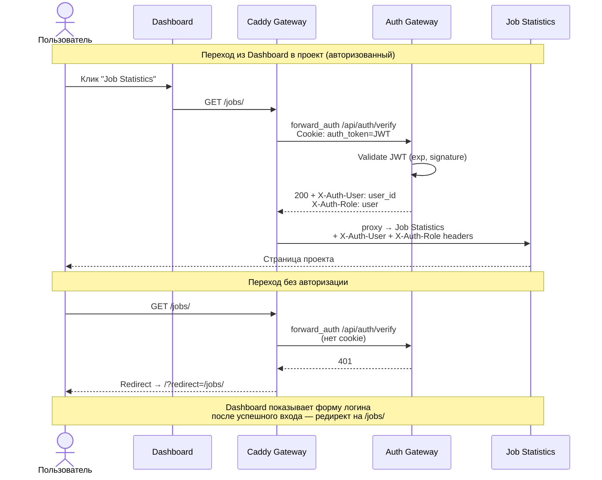
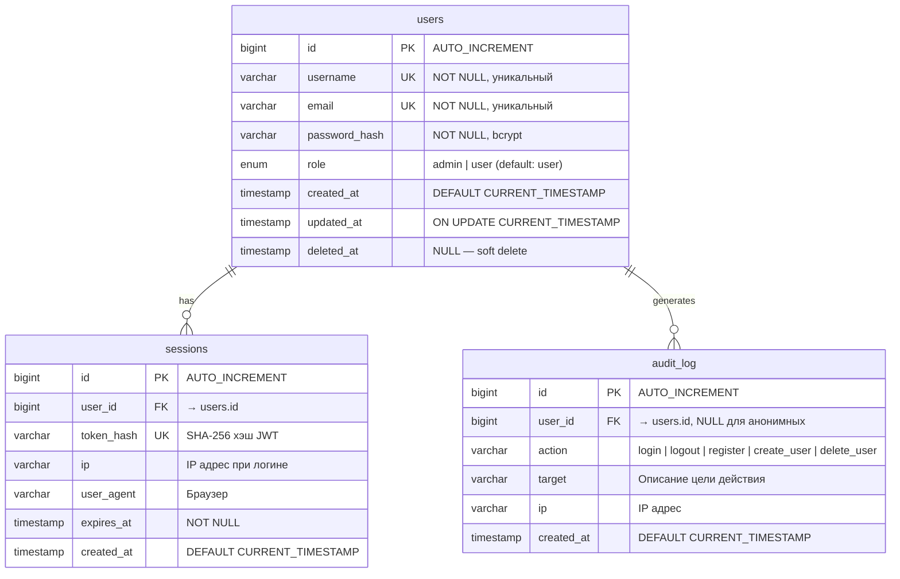
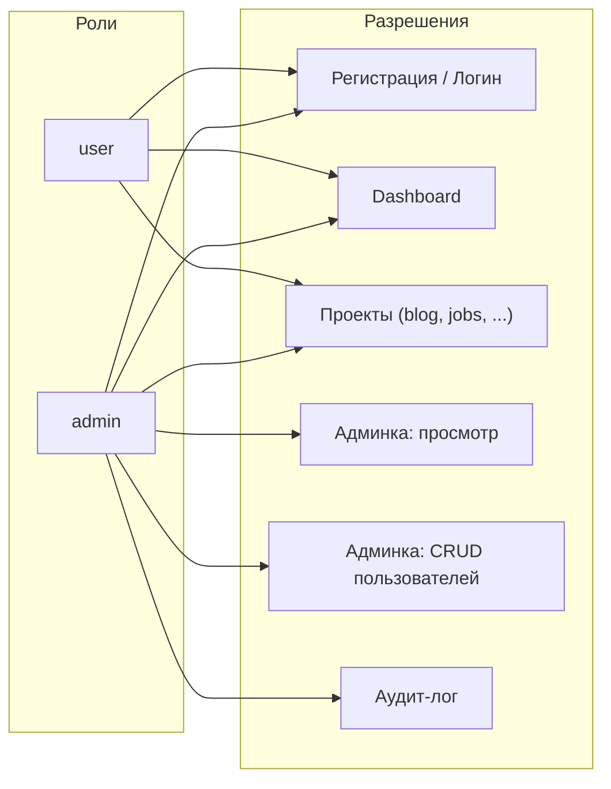
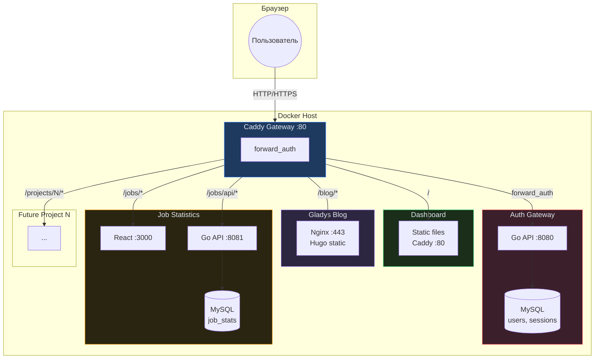
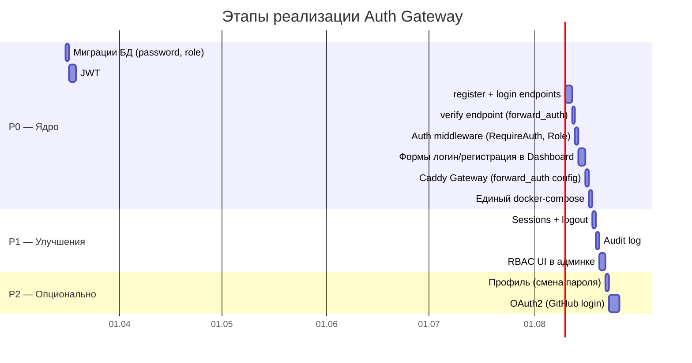

# Архитектура централизованной аутентификации

> Единый auth-сервис для всех локальных проектов с SSO, ролями и Gateway-паттерном.

---

## 1. Обзор

Проект **Auth Gateway** становится центральным сервисом аутентификации и управления пользователями.
**Dashboard** (Productivity) — главная точка входа: регистрация, логин, навигация по проектам.

### Текущие проекты

| Проект | Стек | Порт (внешний) | Доступ |
|--------|------|----------------|--------|
| **Dashboard** | Caddy + static | `8080` | `http://localhost:8080` |
| **Auth Gateway** | Go + MySQL + Caddy | `8888` | `http://localhost:8888/api` |
| **Gladys Blog** | Hugo + Nginx | — | `https://gladys-blog.local.net` |
| **Job Statistics** | Go + React + MySQL | `3000` | `http://localhost:3000` |

### Целевое состояние

Все проекты за единым Caddy reverse proxy. Auth Gateway валидирует каждый запрос через `forward_auth`.

---

## 2. Архитектура компонентов

```
┌─────────────────────────────────────────────────────────────────────┐
│                         CADDY GATEWAY (:80 / :443)                  │
│                                                                     │
│  Все входящие запросы проходят через forward_auth → Auth Service    │
│                                                                     │
│  /                    → Dashboard (static)                          │
│  /api/auth/*          → Auth Gateway (Go API)                       │
│  /blog/*              → Gladys Blog (Nginx)                         │
│  /jobs/*              → Job Statistics (React + Go)                 │
│  /admin/*             → Auth Gateway (Admin UI)                     │
│  /projects/{name}/*   → Будущие проекты                            │
│                                                                     │
└─────────────────────────────────────────────────────────────────────┘
         │
         │ forward_auth /api/auth/verify
         ▼
┌─────────────────┐     ┌──────────────┐     ┌──────────────┐
│  Auth Gateway   │────▶│   MySQL DB   │     │  Dashboard   │
│  (Go :8080)     │     │  (users,     │     │  (Caddy      │
│                 │     │   roles,     │     │   static)    │
│  - /api/auth/*  │     │   sessions)  │     │              │
│  - /api/admin/* │     └──────────────┘     └──────────────┘
└─────────────────┘
         ▲
         │ JWT validation
         │
┌────────┴─────────────────────────────────────────────────┐
│                     Downstream Services                   │
│                                                           │
│  ┌──────────┐  ┌──────────────┐  ┌──────────────────┐   │
│  │  Gladys  │  │ Job Stats    │  │ Future Project N  │   │
│  │  Blog    │  │ (React+Go)   │  │                   │   │
│  └──────────┘  └──────────────┘  └──────────────────┘   │
└──────────────────────────────────────────────────────────┘
```

---

## 3. Диаграмма последовательности: регистрация и логин

```mermaid
sequenceDiagram
    actor U as Пользователь
    participant D as Dashboard<br/>(frontend)
    participant C as Caddy<br/>Gateway
    participant A as Auth Gateway<br/>(Go API)
    participant DB as MySQL

    Note over U,DB: Сценарий 1 — Регистрация (новый пользователь)

    U->>C: GET /
    C->>A: forward_auth /api/auth/verify
    A-->>C: 401 (нет токена)
    C->>D: Отдать Dashboard с формой регистрации

    U->>C: POST /api/auth/register {username, email, password}
    C->>A: proxy → Auth Gateway
    A->>DB: INSERT INTO users (username, email, password_hash, role)
    DB-->>A: OK (user_id)
    A-->>C: 201 {token: JWT, user: {...}}
    C-->>U: Set-Cookie: auth_token=JWT; Path=/; HttpOnly; SameSite=Lax

    Note over U,DB: Сценарий 2 — Логин (существующий пользователь)

    U->>C: POST /api/auth/login {email, password}
    C->>A: proxy → Auth Gateway
    A->>DB: SELECT * FROM users WHERE email = ?
    A->>A: bcrypt.Compare(password, hash)
    A-->>C: 200 {token: JWT, user: {...}}
    C-->>U: Set-Cookie: auth_token=JWT
```

---

## 4. Диаграмма последовательности: SSO при переходе между проектами



---

## 5. Модель данных



---

## 6. Ролевая модель (RBAC)



| Действие | `user` | `admin` |
|----------|--------|---------|
| Регистрация / логин | + | + |
| Просмотр Dashboard | + | + |
| Переход в проекты | + | + |
| Просмотр списка пользователей | - | + |
| Создание пользователей | - | + |
| Удаление пользователей (soft) | - | + |
| Просмотр аудит-лога | - | + |
| Смена роли пользователя | - | + |

---

## 7. JWT-токен

### Структура payload

```json
{
  "sub": "42",
  "username": "friedfox",
  "email": "friedfox@example.com",
  "role": "admin",
  "iat": 1710500000,
  "exp": 1710586400
}
```

### Параметры

| Параметр | Значение |
|----------|----------|
| Алгоритм | HS256 |
| Время жизни | 24 часа |
| Хранение | HttpOnly cookie `auth_token` |
| Обновление | Sliding window: если осталось < 2ч, выдаётся новый при `verify` |
| Отзыв | Удаление записи в таблице `sessions` |

---

## 8. API Auth Gateway

### Публичные эндпоинты (без авторизации)

```
POST /api/auth/register    — Регистрация {username, email, password}
POST /api/auth/login       — Логин {email, password}
GET  /api/auth/verify      — Проверка JWT (для forward_auth)
POST /api/auth/logout      — Выход (удаление сессии + очистка cookie)
```

### Защищённые эндпоинты (role: admin)

```
GET    /api/admin/users           — Список всех пользователей
POST   /api/admin/users/create    — Создать пользователя
DELETE /api/admin/users/:id       — Soft delete пользователя
PATCH  /api/admin/users/:id/role  — Изменить роль {role: "admin"|"user"}
GET    /api/admin/stats           — Статистика
GET    /api/admin/audit           — Аудит-лог
```

---

## 9. Конфигурация Caddy Gateway

Единая точка входа для всех проектов:

```caddy
{
    # Для локальной разработки отключаем auto-HTTPS
    auto_https off
}

:80 {
    # ── Auth: проверка на каждый запрос (кроме публичных) ──
    @protected not path /api/auth/register /api/auth/login /api/auth/verify /api/health

    route @protected {
        forward_auth auth-gateway:8080 {
            uri /api/auth/verify
            copy_headers {
                X-Auth-User
                X-Auth-Role
            }
        }
    }

    # ── Роутинг по проектам ──
    handle /api/auth/* {
        reverse_proxy auth-gateway:8080
    }
    handle /api/admin/* {
        reverse_proxy auth-gateway:8080
    }

    handle /blog/* {
        uri strip_prefix /blog
        reverse_proxy gladys-blog:443 {
            transport http {
                tls_insecure_skip_verify
            }
        }
    }

    handle /jobs/* {
        uri strip_prefix /jobs
        reverse_proxy job-stats-frontend:3000
    }

    handle /jobs/api/* {
        uri strip_prefix /jobs
        reverse_proxy job-stats-api:8081
    }

    # ── Dashboard — всё остальное ──
    handle {
        reverse_proxy dashboard:80
    }

    encode gzip zstd
}
```

---

## 10. Docker Compose: целевая структура

```yaml
# Единый docker-compose.yaml для всех проектов
services:
  # ── Единый Gateway ──
  caddy:
    image: caddy:2-alpine
    ports: ["80:80", "443:443"]
    volumes:
      - ./Caddyfile:/etc/caddy/Caddyfile:ro
    networks: [gateway]
    depends_on: [auth-gateway, dashboard]

  # ── Auth Gateway ──
  auth-gateway:
    build: ../Auth-Gateway/backend
    environment:
      DB_HOST: auth-db
      JWT_SECRET: ${JWT_SECRET}
    networks: [gateway, auth-internal]
    depends_on: [auth-db]

  auth-db:
    image: mysql:8.0
    volumes: [auth_data:/var/lib/mysql]
    networks: [auth-internal]

  # ── Dashboard ──
  dashboard:
    image: caddy:2-alpine
    volumes:
      - ./www:/srv/www:ro
      - ./DashboardCaddyfile:/etc/caddy/Caddyfile:ro
    networks: [gateway]

  # ── Gladys Blog ──
  gladys-blog:
    build: ../Gladys-Blog
    networks: [gateway]

  # ── Job Statistics ──
  job-stats-frontend:
    build: ../job-statistics-platform/frontend
    networks: [gateway]

  job-stats-api:
    build: ../job-statistics-platform/backend
    networks: [gateway, jobs-internal]

  job-stats-db:
    image: mysql:8.0
    networks: [jobs-internal]

networks:
  gateway:        # Все сервисы + Caddy
  auth-internal:  # Auth Gateway ↔ Auth DB
  jobs-internal:  # Job Stats API ↔ Job Stats DB

volumes:
  auth_data:
  jobs_data:
```

---

## 11. Диаграмма развёртывания



---

## 12. Добавление нового проекта — чеклист

При появлении нового проекта:

1. **Docker**: добавить сервис в `docker-compose.yaml`, подключить к сети `gateway`
2. **Caddy**: добавить `handle /newproject/*` блок в Caddyfile
3. **Dashboard**: добавить объект в массив `PROJECTS` в `app.js`:
   ```js
   { id: 'new-project', label: 'New Project', icon: '...', url: '/newproject/', desc: '...' }
   ```
4. **Роли** (при необходимости): добавить project-specific permissions в RBAC
5. **Downstream**: сервис читает `X-Auth-User` и `X-Auth-Role` из headers — авторизация на уровне приложения

Никаких изменений в Auth Gateway не требуется.

---

## 13. Что нужно реализовать в Auth Gateway

### Бэкенд (Go)

| # | Задача | Приоритет |
|---|--------|-----------|
| 1 | Добавить `password_hash` (bcrypt) в модель `User` | P0 |
| 2 | Добавить поле `role` (enum: admin/user) | P0 |
| 3 | Реализовать `POST /api/auth/register` | P0 |
| 4 | Реализовать `POST /api/auth/login` | P0 |
| 5 | Реализовать `GET /api/auth/verify` (forward_auth endpoint) | P0 |
| 6 | JWT: подпись (HS256), валидация, sliding refresh | P0 |
| 7 | Middleware `RequireAuth` — проверка JWT из cookie | P0 |
| 8 | Middleware `RequireRole("admin")` — проверка роли | P0 |
| 9 | Таблица `sessions` + logout | P1 |
| 10 | Таблица `audit_log` + логирование действий | P1 |
| 11 | `PATCH /api/admin/users/:id/role` | P1 |
| 12 | CORS: заменить `*` на конкретный origin Gateway | P1 |

### Фронтенд (Dashboard)

| # | Задача | Приоритет |
|---|--------|-----------|
| 1 | Форма регистрации на Dashboard | P0 |
| 2 | Форма логина на Dashboard | P0 |
| 3 | Redirect-механизм: `/?redirect=/jobs/` | P0 |
| 4 | Показ/скрытие UI элементов по роли | P1 |
| 5 | Страница «Профиль» (смена пароля) | P2 |

### Миграции (SQL)

| # | Файл | Содержание |
|---|------|-----------|
| 1 | `002_add_auth.sql` | `ALTER TABLE users ADD password_hash, ADD role` |
| 2 | `003_sessions.sql` | `CREATE TABLE sessions (...)` |
| 3 | `004_audit_log.sql` | `CREATE TABLE audit_log (...)` |

---

## 14. Порядок реализации



---

## 15. Безопасность

| Мера | Реализация |
|------|-----------|
| Хэширование паролей | bcrypt, cost=12 |
| JWT хранение | HttpOnly, SameSite=Lax cookie |
| CSRF | SameSite=Lax + проверка Origin header для мутаций |
| Rate limiting | 10 req/min на `/api/auth/login` (защита от брутфорса) |
| CORS | Конкретный origin вместо `*` |
| Soft delete | `deleted_at` — пользователи не удаляются физически |
| Аудит | Все auth-действия логируются в `audit_log` |
| Сессии | Хэш токена в БД, возможность отзыва |

---

## 16. Статус реализации

| Компонент | Статус | Детали |
|-----------|--------|--------|
| Миграции БД (password, role, sessions, audit) | ✅ Готово | `002_add_auth.sql`, `003_sessions.sql`, `004_audit_log.sql` |
| JWT (подпись, валидация, sliding refresh) | ✅ Готово | `internal/auth/jwt.go`, HS256, 24ч, refresh < 2ч |
| Auth endpoints (register, login, verify, logout, me) | ✅ Готово | `internal/handlers/auth.go` |
| Auth middleware (RequireAuth, RequireRole) | ✅ Готово | `internal/middleware/middleware.go` |
| Admin endpoints (CRUD, roles, audit) | ✅ Готово | `internal/handlers/admin.go` |
| Admin Panel UI (login, users, audit, stats) | ✅ Готово | `Auth-Gateway/frontend/` |
| Dashboard: auth overlay (login/register) | ✅ Готово | `www/js/auth.js` |
| Dashboard: user badge + logout | ✅ Готово | header user-badge |
| Unified Caddyfile (forward_auth routing) | ✅ Готово | `Caddyfile` |
| Unified docker-compose (all services) | ✅ Готово | profiles: blog, jobs |
| Gladys Blog Dockerfile (unified build) | ✅ Готово | root `Dockerfile` |
| Makefile (up, up-all, up-blog, up-jobs) | ✅ Готово | `Makefile` |
| Sessions + logout | ✅ Готово | P1 включён в P0 |
| Audit log | ✅ Готово | P1 включён в P0 |
| RBAC UI в админке | ✅ Готово | toggle role в admin panel |
